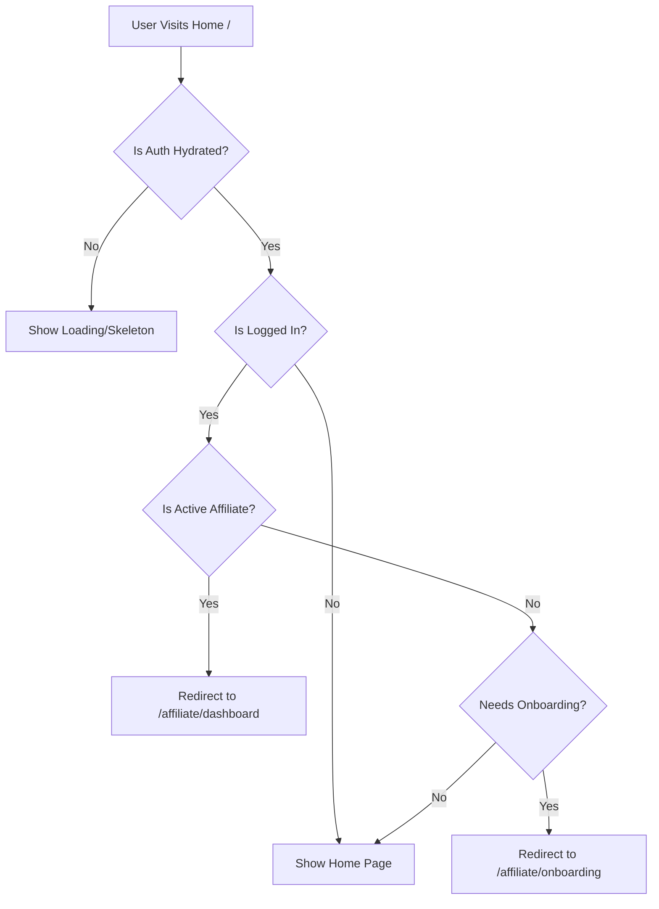

# Affiliate Redirect Architecture Plan

## Current Architecture Analysis

### Existing Flow

1. **Login/Register** → Redirects based on user role/affiliate status in [`useLogin.ts`](src/features/auth/hooks/useLogin.ts:17-32) and [`useRegister.ts`](src/features/auth/hooks/useRegister.ts:17-32)
2. **Auth Hydration** → [`AuthProvider.tsx`](src/providers/AuthProvider.tsx:10-22) loads user data on app startup via `/api/auth/me`
3. **User State** → Stored in Zustand store [`auth.store.ts`](src/store/auth.store.ts) with `isAffiliate` and `affiliateStatus` fields

### Missing Component

Currently, there's **no redirect logic** when a logged-in user visits the home page (`/`). Users stay on home regardless of their affiliate status.

---

## Implementation Plan

### Step 1: Create Reusable Auth Redirect Hook

**File:** `src/features/auth/hooks/useAuthRedirect.ts`

Create a clean, reusable hook that handles affiliate redirects. This follows clean architecture by:

- Encapsulating redirect logic in a single place
- Making it reusable across pages
- Handling hydration state properly

```typescript
interface UseAuthRedirectOptions {
  // Whether to redirect affiliates to their dashboard
  redirectAffiliates?: boolean;
  // Custom base path for affiliate dashboard
  affiliateBasePath?: string;
}
```

**Redirect Logic:**
| Condition | Redirect Target |
|-----------|-----------------|
| `isAffiliate && affiliateStatus === 'active'` | `/affiliate/dashboard` |
| `isAffiliate && affiliateStatus !== 'active'` | `/affiliate/onboarding` |
| Otherwise | Stay on current page |

---

### Step 2: Enhance Auth Store with Helper Methods

**File:** `src/store/auth.store.ts`

Add helper methods to the Zustand store for cleaner code:

- `isAffiliate()` - returns boolean
- `isActiveAffiliate()` - returns boolean (isAffiliate + active status)
- `needsOnboarding()` - returns boolean (isAffiliate + pending/suspended)

---

### Step 3: Implement Redirect in Home Page

**File:** `src/app/(store)/page.tsx`

Use the new hook to redirect authenticated users:

- Wait for auth state to hydrate (prevent redirect on initial load)
- Check affiliate status
- Redirect to appropriate destination

---

### Step 4: Create a Higher-Order Component (Optional)

**File:** `src/features/auth/components/withAffiliateRedirect.tsx`

For reusable "protected" pages that should redirect affiliates away from public pages.

---

## Architecture Diagram



---

## Files to Modify/Create

| Action | File Path                                    |
| ------ | -------------------------------------------- |
| Create | `src/features/auth/hooks/useAuthRedirect.ts` |
| Modify | `src/store/auth.store.ts`                    |
| Modify | `src/app/(store)/page.tsx`                   |

---

## Ready for Future Affiliate System

This architecture is designed to be extensible for:

- Multi-tier affiliate levels
- Affiliate-only product views
- Commission tracking integration
- Referral system enhancements
