# Implementation Plan: Dark + Orange Theme Update

## Overview

Update all store pages to use dark gradient hero sections with orange accent colors, matching the twcako.com design approach.

## Current State vs Target State

### Current Pattern (Needs Update)

- Light gray backgrounds: `bg-gray-50/50`, `bg-gray-50`
- White sections without dark hero
- Gray text on light backgrounds

### Target Pattern (Consistent)

- Dark gradient hero: `bg-gradient-to-br from-gray-950 via-gray-900 to-gray-950`
- White content area with rounded top: `bg-white rounded-t-3xl -mt-8`
- Orange accent colors: `text-orange-500`, `bg-orange-500`
- White text on dark backgrounds

---

## Pages to Update

### 1. ShopDetailPage.tsx

**File:** `src/features/store/shop/ShopDetailPage.tsx`

**Current:**

```tsx
<div className="min-h-screen bg-gray-50/50">
  <div className="max-w-6xl mx-auto px-4 sm:px-6 lg:px-10 xl:px-16 py-6 sm:py-10 lg:py-14">
```

**Should become:**

```tsx
<div className="min-h-screen bg-gradient-to-br from-gray-950 via-gray-900 to-gray-950">
  {/* Hero Header */}
  <section className="py-12 sm:py-16 bg-gradient-to-br from-gray-950 via-gray-900 to-gray-950">
    <div className="w-full max-w-[1440px] mx-auto px-6 sm:px-10 lg:px-16">
      <h1 className="text-3xl sm:text-4xl font-extrabold text-white">{product.name}</h1>
    </div>
  </section>

  {/* Content Area */}
  <div className="bg-white rounded-t-3xl -mt-8 px-6 sm:px-10 lg:px-16 py-10">
```

---

### 2. CartPage.tsx

**File:** `src/features/store/cart/CartPage.tsx`

**Current:**

```tsx
<div className="min-h-screen bg-gray-50/50">
  <div className="w-full px-6 sm:px-10 lg:px-16 py-8 sm:py-12">
```

**Should become:**

```tsx
<div className="min-h-screen bg-gradient-to-br from-gray-950 via-gray-900 to-gray-950">
  {/* Hero Header */}
  <section className="py-12 sm:py-16 bg-gradient-to-br from-gray-950 via-gray-900 to-gray-950">
    <div className="w-full max-w-[1440px] mx-auto px-6 sm:px-10 lg:px-16">
      <h1 className="text-4xl sm:text-5xl font-extrabold text-white">Shopping Cart</h1>
    </div>
  </section>

  {/* Content Area */}
  <div className="bg-white rounded-t-3xl -mt-8 px-6 sm:px-10 lg:px-16 py-10">
```

---

### 3. OrdersPage

**File:** `src/app/(store)/orders/page.tsx`

**Current:** Uses light background pattern

**Should become:** Dark hero + white content area pattern

---

## Implementation Steps

### Step 1: Update ShopDetailPage.tsx

- Add dark gradient hero section
- Move product title to hero
- Update content area to white with rounded top
- Update text colors for dark/light sections

### Step 2: Update CartPage.tsx

- Add dark gradient hero section
- Add product count badge
- Update content area styling
- Update text colors

### Step 3: Update Orders Page

- Find and update orders page component
- Apply dark hero + white content pattern

### Step 4: Verify Consistency

- Check all store pages use consistent colors
- Ensure orange accents appear correctly
- Verify text contrast on dark backgrounds

---

## Color Palette Reference

| Element              | Current           | Target                                                     |
| -------------------- | ----------------- | ---------------------------------------------------------- |
| Page background      | `bg-gray-50/50`   | `bg-gradient-to-br from-gray-950 via-gray-900 to-gray-950` |
| Content background   | White             | White with rounded-t-3xl                                   |
| Primary text (dark)  | `text-gray-900`   | Keep `text-gray-900` on white                              |
| Primary text (light) | `text-gray-900`   | `text-white` on dark                                       |
| Accent color         | `text-orange-500` | Keep `text-orange-500`                                     |
| CTA buttons          | `bg-orange-500`   | Keep `bg-orange-500`                                       |
| Headings             | Various           | White on dark hero                                         |

---

## Mermaid Diagram: Target Layout

```mermaid
flowchart TB
    subgraph "Page Layout"
        A[Dark Hero Section] --> B[White Content Card]
        B --> C[Optional Footer]
    end

    A --> A1[Page Title - White]
    A --> A2[Max-width 1440px]
    A --> A3[Padding py-12-16]

    B --> B1[Rounded top -mt-8]
    B --> B2[Shadow effects]
    B --> B3[Inner padding]

    style A fill:#1a1a2e,stroke:#ff9900
    style B fill:#ffffff,stroke:#ddd
```


