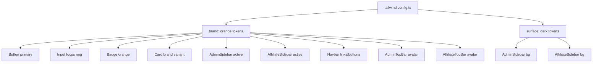
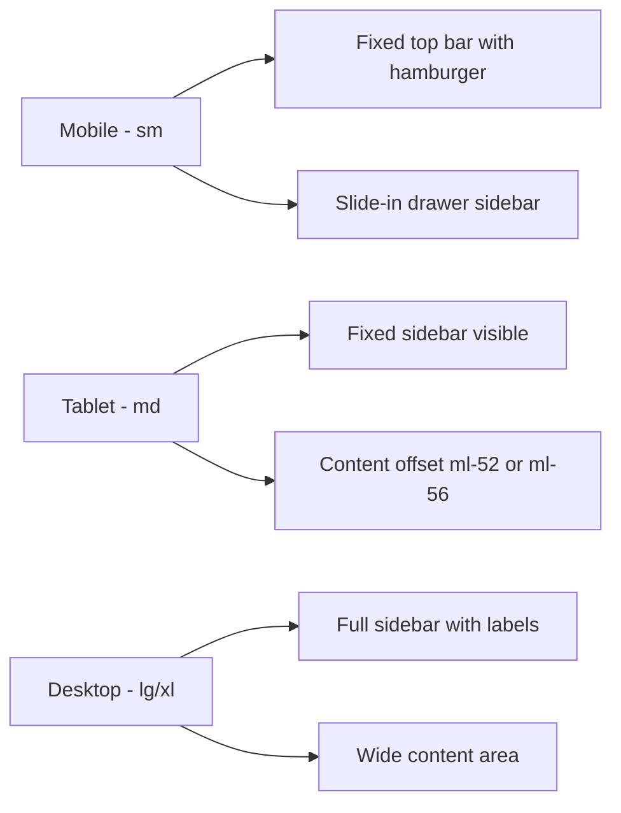

# Design Uniformity Plan: Orange & Dark Theme

## Overview

This plan standardizes the entire application's design system around an **orange + dark** color palette, making it responsive, professional, and modern across all pages.

---

## Current State Analysis

### Color Inconsistencies Found

| Area                     | Current Colors                     | Problem            |
| ------------------------ | ---------------------------------- | ------------------ |
| AdminSidebar             | `purple-600` active, `gray-900` bg | Purple, not orange |
| AffiliateSidebar         | `purple-600` active, `#0f0a1e` bg  | Purple, not orange |
| Navbar                   | `purple-600` throughout            | Purple, not orange |
| Button primary           | `blue-600`                         | Blue, not orange   |
| Input focus ring         | `blue-500`                         | Blue, not orange   |
| Card purple variant      | `purple-50/100`                    | Purple, not orange |
| Badge purple             | `purple-100/700`                   | Purple, not orange |
| AdminTopBar avatar       | `blue-600`                         | Blue, not orange   |
| AffiliateTopBar avatar   | `purple-600`                       | Purple, not orange |
| DashboardPage spinner    | `emerald-500`                      | Green, not orange  |
| Tailwind brand color     | `#2563eb` (blue)                   | Blue, not orange   |
| Focus ring (globals.css) | `#7c3aed` (purple)                 | Purple, not orange |
| Onboarding page          | `purple-600` gradient bg           | Purple, not orange |
| HomePage benefits        | Mixed purple/blue/emerald/amber    | Inconsistent       |

### Responsiveness Issues

- Admin layout uses fixed `ml-52` — no mobile sidebar support
- Admin sidebar has no mobile drawer/hamburger
- Dashboard grid uses `grid-cols-4` — breaks on mobile

---

## Design System: Orange + Dark

### Color Palette

```
Primary Orange:
  - orange-500: #f97316  (main brand)
  - orange-600: #ea580c  (hover/active)
  - orange-400: #fb923c  (light accent)
  - orange-50:  #fff7ed  (light bg tint)
  - orange-100: #ffedd5  (badge bg)

Dark:
  - gray-950:  #030712   (deepest dark)
  - gray-900:  #111827   (sidebar bg)
  - gray-800:  #1f2937   (hover on dark)
  - gray-700:  #374151   (borders on dark)

Text on dark:
  - white:     #ffffff   (primary text)
  - gray-400:  #9ca3af   (secondary text)
  - gray-500:  #6b7280   (muted text)
```

### Typography

- Font: Inter (via Google Fonts, added to layout.tsx)
- Headings: `font-bold` or `font-semibold`
- Body: `text-sm` or `text-base`

---

## Architecture: Design Token Strategy

Instead of scattering color classes everywhere, we use Tailwind's `theme.extend.colors` to define semantic tokens:

```ts
// tailwind.config.ts
colors: {
  brand: {
    DEFAULT: "#f97316",   // orange-500
    light:   "#fb923c",   // orange-400
    dark:    "#ea580c",   // orange-600
    50:      "#fff7ed",
    100:     "#ffedd5",
  },
  surface: {
    DEFAULT: "#111827",   // gray-900 (sidebar/dark bg)
    hover:   "#1f2937",   // gray-800
    border:  "#374151",   // gray-700
  }
}
```

---

## Files to Modify

### Phase 1: Foundation

#### `tailwind.config.ts`

- Replace `brand` blue with orange tokens
- Add `surface` dark tokens

#### `src/app/globals.css`

- Change focus ring from `#7c3aed` (purple) to `#f97316` (orange)
- Add Inter font import

#### `src/app/layout.tsx`

- Add Inter font from `next/font/google`

---

### Phase 2: Shared UI Components

#### `src/shared/components/ui/Button.tsx`

- `primary`: `bg-orange-500 hover:bg-orange-600 text-white`
- `secondary`: `bg-gray-900 hover:bg-gray-800 text-white`
- `ghost`: `border border-gray-200 hover:bg-gray-50 text-gray-700`
- `danger`: `bg-red-600 hover:bg-red-700 text-white`
- Remove `purple` variant (replace with `brand` or keep as orange)

#### `src/shared/components/ui/Input.tsx`

- Focus ring: `focus:ring-orange-500`
- Border: `border-gray-200`

#### `src/shared/components/ui/Card.tsx`

- Replace `purple` variant with `brand` variant: `bg-orange-50 border-orange-100`

#### `src/shared/components/ui/Badge.tsx`

- Replace `purple` color with `orange`: `bg-orange-100 text-orange-700`
- Keep other status colors (green, red, yellow, etc.)

---

### Phase 3: Layout Components

#### `src/shared/components/layout/AdminSidebar.tsx`

- Background: `bg-gray-900` (keep dark)
- Active link: `bg-orange-500 text-white` (replace purple)
- Logo icon: `bg-orange-500` (replace purple)
- Add mobile hamburger + drawer (responsive)

#### `src/shared/components/layout/AdminTopBar.tsx`

- Avatar: `bg-orange-500 hover:bg-orange-600` (replace blue)

#### `src/shared/components/layout/Navbar.tsx`

- All `purple-*` → `orange-*`
- Cart badge: `bg-orange-500`
- Sign In button: `bg-orange-500 hover:bg-orange-600`
- Profile avatar: `from-orange-500 to-orange-600`
- Nav link hover underline: `bg-orange-500`

#### `src/features/affiliate/shared/components/AffiliateSidebar.tsx`

- Background: keep `bg-[#0f0a1e]` or change to `bg-gray-900`
- Active link: `bg-orange-500 text-white` (replace purple)
- Logo icon: `bg-orange-500` (replace purple)
- User avatar: `bg-orange-600` (replace purple)

#### `src/features/affiliate/shared/components/AffiliateTopBar.tsx`

- Avatar: `bg-orange-500` (replace purple)

---

### Phase 4: Admin Layout

#### `src/app/(admin)/layout.tsx`

- Add mobile responsiveness: hamburger button, collapsible sidebar
- Change `ml-52` to responsive `md:ml-52`

#### `src/features/admin/components/AdminPageLayout.tsx`

- Loading spinner: `text-orange-500` (replace emerald)
- Title styling: consistent `text-gray-900`

---

### Phase 5: Admin Pages

#### `src/features/admin/dashboard/DashboardPage.tsx`

- Stat cards: add orange accent border/icon color
- Loading spinner: `text-orange-500`
- Grid: `grid-cols-1 sm:grid-cols-2 lg:grid-cols-4` (responsive)

#### Admin tables (all pages):

- Table header: `bg-gray-50` with `text-gray-500`
- Hover row: `hover:bg-orange-50/30`
- Action buttons: orange primary

#### Admin modals:

- Header accent: orange
- Primary action buttons: orange

---

### Phase 6: Affiliate Pages

#### `src/features/affiliate/shared/components/AffiliateStatCard.tsx`

- Icon container: `bg-orange-100 text-orange-600`

#### `src/features/affiliate/dashboard/AffiliateDashboardPage.tsx`

- Consistent orange stat cards

#### All affiliate pages:

- Replace any remaining purple with orange

---

### Phase 7: Store Pages

#### `src/features/store/home/HomePage.tsx`

- Benefits section: replace mixed colors with orange-themed icons
- CTA buttons: orange
- Section headings: consistent

#### `src/app/affiliate/landing/page.tsx`

- Replace any purple/blue with orange

#### `src/app/(auth)/login/page.tsx`

- Replace purple/blue with orange
- Sign In button: orange

#### `src/features/affiliate/onboarding/AffiliateOnboardingPage.tsx`

- Background gradient: dark (replace purple gradient)
- Brand icon: orange
- Buttons: orange

---

## Mermaid: Design System Architecture



---

## Mermaid: Responsive Layout Strategy



---

## Summary of Color Replacements

| Old Color     | New Color    | Usage                                |
| ------------- | ------------ | ------------------------------------ |
| `purple-600`  | `orange-500` | Active nav, avatars, primary actions |
| `purple-700`  | `orange-600` | Hover states                         |
| `purple-50`   | `orange-50`  | Light backgrounds                    |
| `purple-100`  | `orange-100` | Badge backgrounds                    |
| `purple-400`  | `orange-400` | Light accents                        |
| `blue-600`    | `orange-500` | Button primary, avatars              |
| `blue-500`    | `orange-500` | Input focus rings                    |
| `blue-50`     | `orange-50`  | Light info backgrounds               |
| `emerald-500` | `orange-500` | Loading spinners                     |
| `#7c3aed`     | `#f97316`    | CSS focus ring                       |
| `#2563eb`     | `#f97316`    | Tailwind brand token                 |

---

## Files Affected (Complete List)

### Foundation

- `tailwind.config.ts`
- `src/app/globals.css`
- `src/app/layout.tsx`

### Shared UI

- `src/shared/components/ui/Button.tsx`
- `src/shared/components/ui/Input.tsx`
- `src/shared/components/ui/Card.tsx`
- `src/shared/components/ui/Badge.tsx`
- `src/shared/components/ui/Spinner.tsx`

### Layout

- `src/shared/components/layout/AdminSidebar.tsx`
- `src/shared/components/layout/AdminTopBar.tsx`
- `src/shared/components/layout/Navbar.tsx`
- `src/features/affiliate/shared/components/AffiliateSidebar.tsx`
- `src/features/affiliate/shared/components/AffiliateTopBar.tsx`
- `src/features/affiliate/shared/components/AffiliateStatCard.tsx`
- `src/app/(admin)/layout.tsx`
- `src/features/admin/components/AdminPageLayout.tsx`

### Admin Pages

- `src/features/admin/dashboard/DashboardPage.tsx`
- `src/features/admin/components/SearchInput.tsx`
- `src/features/admin/components/FilterSelect.tsx`

### Affiliate Pages

- `src/features/affiliate/dashboard/AffiliateDashboardPage.tsx`
- `src/features/affiliate/onboarding/AffiliateOnboardingPage.tsx`

### Store Pages

- `src/features/store/home/HomePage.tsx`
- `src/app/affiliate/landing/page.tsx`
- `src/app/(auth)/login/page.tsx`
