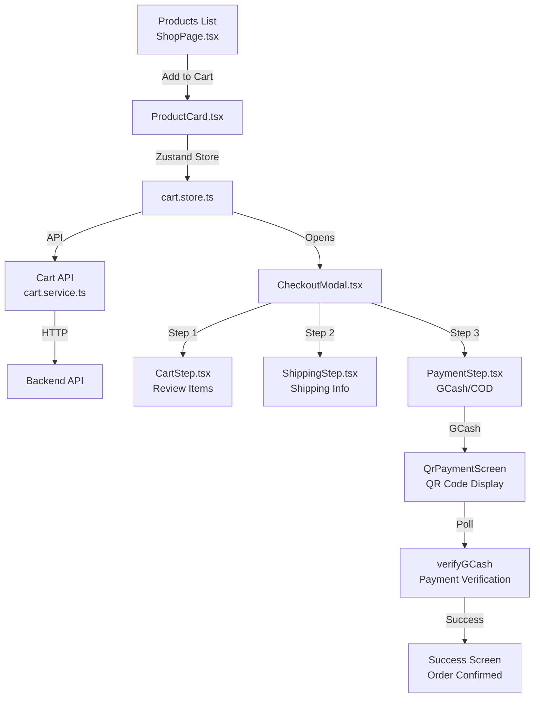
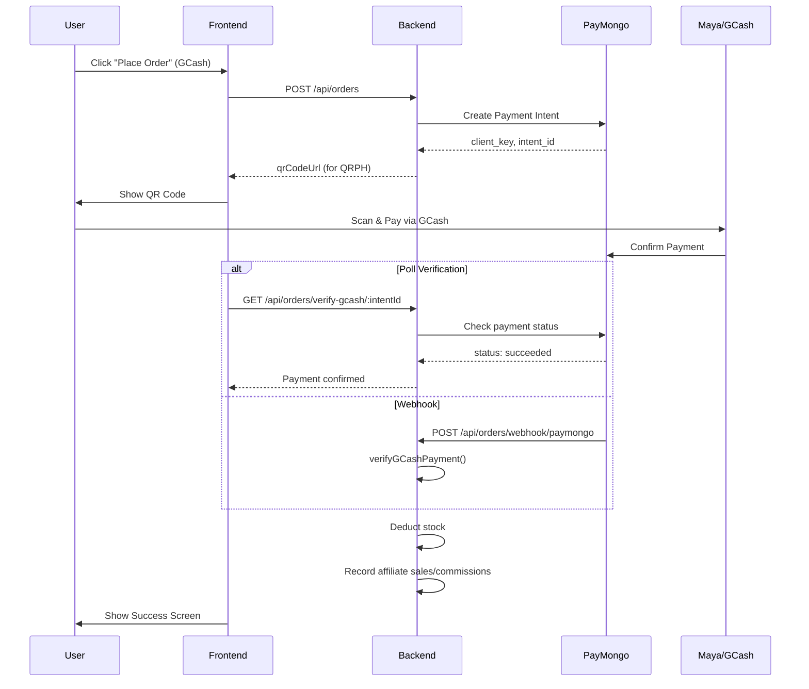

# E-Commerce Integration Plan: Products → Cart → Checkout → Payment

## Executive Summary

This document provides a comprehensive analysis and plan for the complete e-commerce flow from **Products List → Add to Cart → Checkout → Shipping → Payment (PayMongo/Maya)**. The analysis covers both the Frontend (Next.js) and Backend (Express.js) implementations.

---

## Current Implementation Status: ✅ FULLY IMPLEMENTED

The entire e-commerce flow is already fully implemented in the codebase. This document serves as a reference for the endpoints, services, and components involved.

---

## Frontend Architecture (Next.js)

### Flow Diagram



---

## Frontend Components & Services

### 1. Products List (Shop Page)

| Component      | File                                                                                                             | Purpose                                               |
| -------------- | ---------------------------------------------------------------------------------------------------------------- | ----------------------------------------------------- |
| ShopPage       | [`src/features/store/shop/ShopPage.tsx`](src/features/store/shop/ShopPage.tsx)                                   | Main shop page with product grid, filters, pagination |
| ProductCard    | [`src/features/store/shop/components/ProductCard.tsx`](src/features/store/shop/components/ProductCard.tsx)       | Individual product card with Add to Cart              |
| ProductGallery | [`src/features/store/shop/components/ProductGallery.tsx`](src/features/store/shop/components/ProductGallery.tsx) | Product image gallery                                 |
| ShopFilters    | [`src/features/store/shop/components/ShopFilters.tsx`](src/features/store/shop/components/ShopFilters.tsx)       | Category and search filters                           |
| useShops       | [`src/features/store/shop/hooks/useShops.ts`](src/features/store/shop/hooks/useShops.ts)                         | Hook for fetching products                            |

### 2. Cart Management

| Component   | File                                                                                                       | Purpose                      |
| ----------- | ---------------------------------------------------------------------------------------------------------- | ---------------------------- |
| CartStore   | [`src/store/cart.store.ts`](src/store/cart.store.ts)                                                       | Zustand store for cart state |
| useCart     | [`src/features/store/cart/hooks/useCart.ts`](src/features/store/cart/hooks/useCart.ts)                     | Hook for cart operations     |
| CartService | [`src/features/store/cart/services/cart.service.ts`](src/features/store/cart/services/cart.service.ts)     | API service for cart         |
| CartPage    | [`src/features/store/cart/CartPage.tsx`](src/features/store/cart/CartPage.tsx)                             | Full cart page               |
| CartItemRow | [`src/features/store/cart/components/CartItemRow.tsx`](src/features/store/cart/components/CartItemRow.tsx) | Individual cart item         |
| CartSummary | [`src/features/store/cart/components/CartSummary.tsx`](src/features/store/cart/components/CartSummary.tsx) | Cart totals                  |

### 3. Checkout Flow

| Component       | File                                                                                                           | Purpose                            |
| --------------- | -------------------------------------------------------------------------------------------------------------- | ---------------------------------- |
| CheckoutModal   | [`src/features/store/home/modals/CheckoutModal.tsx`](src/features/store/home/modals/CheckoutModal.tsx)         | Main checkout modal (3-step)       |
| CartStep        | [`src/features/store/order/components/CartStep.tsx`](src/features/store/order/components/CartStep.tsx)         | Step 1: Review cart items          |
| ShippingStep    | [`src/features/store/order/components/ShippingStep.tsx`](src/features/store/order/components/ShippingStep.tsx) | Step 2: Shipping information       |
| PaymentStep     | [`src/features/store/order/components/PaymentStep.tsx`](src/features/store/order/components/PaymentStep.tsx)   | Step 3: Payment method (GCash/COD) |
| QrPaymentScreen | [`CheckoutModal.tsx:144`](src/features/store/home/modals/CheckoutModal.tsx:144)                                | GCash QR code display with polling |
| SuccessScreen   | [`CheckoutModal.tsx:108`](src/features/store/home/modals/CheckoutModal.tsx:108)                                | Order success confirmation         |

### 4. Order Service

| Service      | File                                                                                                       | Purpose                          |
| ------------ | ---------------------------------------------------------------------------------------------------------- | -------------------------------- |
| OrderService | [`src/features/store/order/services/order.service.ts`](src/features/store/order/services/order.service.ts) | Order operations (place, verify) |
| useOrder     | [`src/features/store/order/hooks/useOrder.ts`](src/features/store/order/hooks/useOrder.ts)                 | Hook for order operations        |

### 5. Admin Management

| Feature         | Hook                                                                                    | Service                                                                                                | API                                                                       |
| --------------- | --------------------------------------------------------------------------------------- | ------------------------------------------------------------------------------------------------------ | ------------------------------------------------------------------------- |
| Orders          | [`useAdminOrders.ts`](src/features/admin/orders/hooks/useAdminOrders.ts)                | [`admin-order.service.ts`](src/features/admin/orders/services/admin-order.service.ts)                  | [`admin-orders.api.ts`](src/infrastructure/api/admin-orders.api.ts)       |
| Stocks          | [`useStocks.ts`](src/features/admin/stocks/hooks/useStocks.ts)                          | [`stocks.service.ts`](src/features/admin/stocks/services/stocks.service.ts)                            | [`stock.api.ts`](src/infrastructure/api/stock.api.ts)                     |
| Affiliate Sales | [`useAffiliateSales.ts`](src/features/admin/affiliate-sales/hooks/useAffiliateSales.ts) | [`affiliate-sales.service.ts`](src/features/admin/affiliate-sales/services/affiliate-sales.service.ts) | [`affiliate-sales.api.ts`](src/infrastructure/api/affiliate-sales.api.ts) |
| Affiliates      | [`useAdminAffiliates.ts`](src/features/admin/affiliates/hooks/useAdminAffiliates.ts)    | [`affiliate.service.ts`](src/features/admin/affiliates/services/affiliate.service.ts)                  | [`affiliate.api.ts`](src/infrastructure/api/affiliate.api.ts)             |

---

## Backend API Endpoints

### Base URL

- **Development:** `http://localhost:4000`
- **Production:** `https://api.triecommerce.com`

### Products API

| Method | Endpoint            | Description            |
| ------ | ------------------- | ---------------------- |
| GET    | `/api/products`     | List all products      |
| GET    | `/api/products/:id` | Get single product     |
| POST   | `/api/products`     | Create product (admin) |
| PATCH  | `/api/products/:id` | Update product (admin) |
| DELETE | `/api/products/:id` | Delete product (admin) |

**Location:** [`ecommerce-api/src/modules/products/`](C:/Users/Noel/Documents/ecommerce-api/src/modules/products/)

### Cart API

| Method | Endpoint              | Description           |
| ------ | --------------------- | --------------------- |
| GET    | `/api/cart`           | Get cart items        |
| POST   | `/api/cart/items`     | Add item to cart      |
| PATCH  | `/api/cart/items/:id` | Update cart item      |
| DELETE | `/api/cart/items/:id` | Remove item from cart |
| DELETE | `/api/cart`           | Clear cart            |

**Location:** [`ecommerce-api/src/modules/cart/`](C:/Users/Noel/Documents/ecommerce-api/src/modules/cart/)

### Orders API

| Method | Endpoint                             | Description                 |
| ------ | ------------------------------------ | --------------------------- |
| POST   | `/api/orders`                        | Place new order             |
| GET    | `/api/orders`                        | Get user's orders           |
| GET    | `/api/orders/:id`                    | Get single order            |
| GET    | `/api/orders/admin/all`              | Get all orders (admin)      |
| GET    | `/api/orders/admin/:id`              | Get order by ID (admin)     |
| PATCH  | `/api/orders/admin/:id/status`       | Update order status (admin) |
| GET    | `/api/orders/verify-gcash/:intentId` | Verify GCash payment        |
| POST   | `/api/orders/webhook/paymongo`       | PayMongo webhook            |

**Location:** [`ecommerce-api/src/modules/order/`](C:/Users/Noel/Documents/ecommerce-api/src/modules/order/)

### Stocks API

| Method | Endpoint                 | Description          |
| ------ | ------------------------ | -------------------- |
| GET    | `/api/stocks`            | Get all stock levels |
| GET    | `/api/stocks/:productId` | Get stock by product |
| PATCH  | `/api/stocks/:productId` | Update stock         |

**Location:** [`ecommerce-api/src/modules/stocks/`](C:/Users/Noel/Documents/ecommerce-api/src/modules/stocks/)

### Affiliates API

| Method | Endpoint                                  | Description                           |
| ------ | ----------------------------------------- | ------------------------------------- |
| GET    | `/api/affiliates`                         | List all affiliates (admin)           |
| GET    | `/api/affiliates/me`                      | Current user's affiliate status       |
| POST   | `/api/affiliates`                         | Create affiliate (admin)              |
| PATCH  | `/api/affiliates/:id`                     | Update affiliate (admin)              |
| DELETE | `/api/affiliates/:id`                     | Delete affiliate (admin)              |
| GET    | `/api/affiliates/:id/products`            | Get affiliate's products              |
| POST   | `/api/affiliates/:id/products`            | Assign product to affiliate           |
| DELETE | `/api/affiliates/:id/products/:productId` | Remove product from affiliate         |
| POST   | `/api/affiliates/payment/create`          | Create affiliate registration payment |
| GET    | `/api/affiliates/payment/verify`          | Verify payment                        |

**Location:** [`ecommerce-api/src/modules/affiliates/`](C:/Users/Noel/Documents/ecommerce-api/src/modules/affiliates/)

### Affiliate Sales API

| Method | Endpoint                           | Description          |
| ------ | ---------------------------------- | -------------------- |
| GET    | `/api/affiliate-sales`             | List affiliate sales |
| GET    | `/api/affiliate-sales/:id`         | Get single sale      |
| PATCH  | `/api/affiliate-sales/:id/status`  | Update sale status   |
| PATCH  | `/api/affiliate-sales/:id/approve` | Approve sale         |
| PATCH  | `/api/affiliate-sales/:id/reject`  | Reject sale          |

**Location:** [`ecommerce-api/src/modules/affiliates-sales/`](C:/Users/Noel/Documents/ecommerce-api/src/modules/affiliates-sales/)

---

## Payment Integration (PayMongo/Maya)

### Flow



### Key Backend Functions

| Function               | File                                                                                               | Purpose                        |
| ---------------------- | -------------------------------------------------------------------------------------------------- | ------------------------------ |
| createPaymentIntent    | [`paymongo.utils`](C:/Users/Noel/Documents/ecommerce-api/src/utils/paymongo.utils.ts)              | Create PayMongo payment intent |
| attachMayaToIntent     | [`paymongo.utils`](C:/Users/Noel/Documents/ecommerce-api/src/utils/paymongo.utils.ts)              | Attach Maya/GCash to intent    |
| getPaymentIntentStatus | [`paymongo.utils`](C:/Users/Noel/Documents/ecommerce-api/src/utils/paymongo.utils.ts)              | Check payment status           |
| placeOrder             | [`order.service.ts`](C:/Users/Noel/Documents/ecommerce-api/src/modules/order/order.service.ts)     | Orchestrate order creation     |
| verifyGCashPayment     | [`order.service.ts`](C:/Users/Noel/Documents/ecommerce-api/src/modules/order/order.service.ts:185) | Verify and confirm payment     |

---

## Affiliate Commission System

### How It Works

1. **Product Assignment:** Admin assigns products to affiliates with commission rules (percentage or fixed)
2. **Order Placement:** Customer places order via affiliate referral link
3. **Attribution:** System attributes order to the referring affiliate
4. **Commission Recording:** When order is paid/delivered, affiliate_sales records are created
5. **Commission Approval:** Admin approves/rejects commissions
6. **Payout:** Affiliate can request cashout

### Key Tables

- `affiliates` - Affiliate profiles
- `affiliate_products` - Product assignments with commission rules
- `affiliate_sales` - Individual sale commissions
- `affiliate_attributions` - Order attribution records

### Commission Calculation

```typescript
// From affiliate-sales.repository.ts:42-46
const commissionEarned =
  ap.commission_type === "percentage"
    ? (lineTotal * ap.commission_value) / 100
    : ap.commission_value * item.quantity;
```

---

## Implementation Checklist

Since everything is already implemented, here are the key integration points:

### Frontend Integration ✅

- [x] Products list with filtering/pagination
- [x] Add to cart functionality
- [x] Cart page and modal
- [x] Checkout modal (3-step)
- [x] Shipping form validation
- [x] Payment method selection (GCash/COD)
- [x] QR code display and polling
- [x] Order success confirmation

### Backend Integration ✅

- [x] Products CRUD
- [x] Cart operations
- [x] Order creation with payment
- [x] Stock management
- [x] Affiliate system
- [x] Commission tracking

### Admin Features ✅

- [x] Order management
- [x] Stock management
- [x] Affiliate management
- [x] Product assignment to affiliates
- [x] Commission/sales tracking

---

## Environment Variables Required

### Frontend (.env)

```
NEXT_PUBLIC_API_URL=http://localhost:4000
NEXT_PUBLIC_FRONTEND_URL=http://localhost:3000
```

### Backend (.env)

```
PORT=4000
SUPABASE_URL=...
SUPABASE_ANON_KEY=...
SUPABASE_SERVICE_KEY=...
PAYMONGO_SECRET_KEY=sk_...
FRONTEND_URL=http://localhost:3000
BACKEND_URL=http://localhost:4000
```

---

## Conclusion

The entire e-commerce flow from products list through checkout and payment is **fully implemented** in the codebase. The integration between:

1. **Frontend ↔ Backend** - via REST API
2. **Checkout ↔ PayMongo** - via payment intents and webhooks
3. **Orders ↔ Affiliate Commission** - via automatic commission recording

All work together seamlessly. No additional implementation is required unless there are specific customizations or bug fixes needed.
