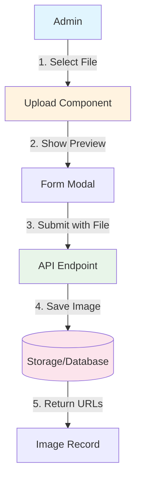

# Image Library Analysis & Improvement Plan

## Current Implementation Overview

### Admin Side (`src/features/admin/image-library/`)

- **CRUD Operations**: ✅ Create, Read, Update, Delete images
- **Fields**: `title`, `imageUrl`, `thumbnailUrl`, `category`, `description`, `displayOrder`, `isActive`
- **Categories**: `banners`, `gallery`, `testimonials`, `partners`
- **Features**: Search, filter by category, pagination
- **Issue**: Only manual URL entry - NO file upload

### User Side (`src/features/affiliate/media-library/`)

- ✅ Displays images in grid layout
- ✅ Has "View Full" and "Download" buttons
- ✅ Category filter added
- ✅ Grouped display by category

---

## Requirements Analysis

| Requirement                | Current Status           | Action Needed           |
| -------------------------- | ------------------------ | ----------------------- |
| Upload image (admin)       | ❌ Manual URL entry only | Implement file upload   |
| With title                 | ✅ Implemented           | Keep as-is              |
| Thumbnail                  | ⚠️ Separate URL field    | Auto-generate or manual |
| Download by user           | ✅ Implemented           | Keep as-is              |
| CRUD by admin              | ✅ Implemented           | Keep as-is              |
| Category filter (user)     | ✅ Implemented           | Keep as-is              |
| Display by category (user) | ✅ Implemented           | Keep as-is              |

---

## Admin Image Upload Implementation Plan

### Architecture

### Implementation Steps

#### Step 1: Add Upload API Client

- Create upload method in `src/infrastructure/api/image-library.api.ts`
- Endpoint: `POST /api/admin/image-library/upload`
- Handle multipart/form-data

#### Step 2: Create Upload Component

- Create `src/features/admin/image-library/components/ImageUpload.tsx`
- Drag-and-drop zone
- File input fallback
- Preview of selected image
- Progress indicator
- Supported formats: jpg, png, gif, webp
- Max file size: 5MB

#### Step 3: Update Form Modal

- Replace image URL input with upload component
- Keep thumbnail URL as optional manual entry (or auto-generate)
- Add preview of uploaded image

#### Step 4: Backend API (if needed)

- Create `POST /api/admin/image-library/upload` endpoint
- Save uploaded file to storage
- Generate thumbnail (optional - can use same image)
- Return `imageUrl` and `thumbnailUrl`

---

## Files to Modify

### New Files

| File                         | Description                |
| ---------------------------- | -------------------------- |
| `components/ImageUpload.tsx` | Drag-drop upload component |

### Modified Files

| File                                      | Changes                   |
| ----------------------------------------- | ------------------------- |
| `infrastructure/api/image-library.api.ts` | Add upload method         |
| `components/ImageLibraryFormModal.tsx`    | Add upload component      |
| `services/image-library.service.ts`       | Add upload service method |

---

## Summary

The plan extends the image library with:

1. **Admin Upload Feature**: File upload with drag-and-drop, preview, and progress
2. **Thumbnail Support**: Auto-generate or manual thumbnail URL entry
3. **User Features**: Category filter, grouped display, download (already implemented)

The backend will need a corresponding API endpoint to handle file uploads.
