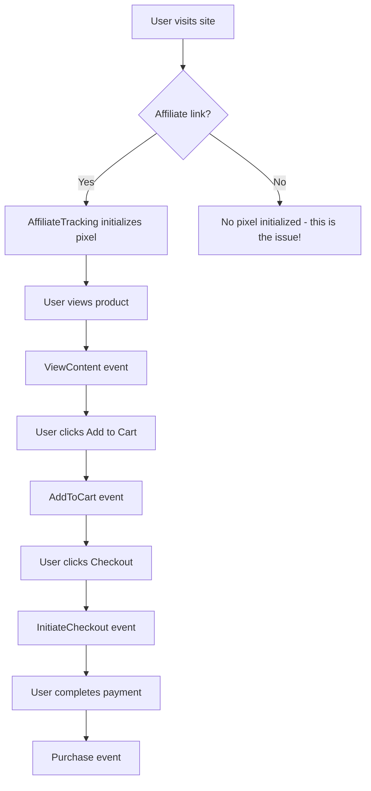

# Meta Pixel Events Implementation Plan

## Problem Summary

The Meta Event Setup tool shows **"A pixel wasn't detected on this website"** because the required pixel events are not being triggered when visitors browse the site.

## Current State Analysis

### Already Implemented

1. **Meta Pixel Library** (`src/lib/meta-pixel.ts`):
   - `initMetaPixel(pixelId, referralCode)` - initializes pixel
   - `trackPageView()` - works via AffiliateTracking component
   - `trackPurchase(value, currency, items)` - implemented and used in checkout
   - `trackAddToCart(value, currency, items)` - exists but NOT called
   - `trackViewContent(productId, value, currency)` - exists but NOT called
   - `trackLead()` - exists
   - `trackCompleteRegistration(value, currency)` - exists

2. **AffiliateTracking Component** (`src/features/store/affiliate/AffiliateTracking.tsx`):
   - Initializes pixel on page load for affiliate-tracked visits

### Missing Implementation

| Event                | Status                         | Where to Add                                       |
| -------------------- | ------------------------------ | -------------------------------------------------- |
| **ViewContent**      | Function exists but NOT called | Product detail page (ShopDetailPage)               |
| **AddToCart**        | Function exists but NOT called | Cart add actions in ShopDetailPage and ProductCard |
| **InitiateCheckout** | Function DOES NOT EXIST        | Checkout flow start point                          |
| **Purchase**         | ✅ Implemented                 | Checkout callback and CheckoutModal                |

## Implementation Plan

### Step 1: Add trackInitiateCheckout function to meta-pixel library

- Location: `src/lib/meta-pixel.ts`
- Add new export function `trackInitiateCheckout(value, currency, items)`
- Should track "InitiateCheckout" event with cart contents

### Step 2: Implement ViewContent event on product pages

- Location: `src/features/store/shop/ShopDetailPage.tsx`
- Import `trackViewContent` from `@/lib/meta-pixel`
- Call on component mount when product data is loaded
- Pass: product.id, product.price, "PHP"

### Step 3: Implement AddToCart event on add to cart actions

- Location: `src/features/store/shop/ShopDetailPage.tsx` (handleAddToCart)
- Location: `src/features/store/shop/components/ProductCard.tsx`
- Import `trackAddToCart` from `@/lib/meta-pixel`
- Call after successful addToCart mutation
- Pass: item price \* quantity, "PHP", items array

### Step 4: Implement InitiateCheckout event

- Location: `src/features/store/home/modals/CheckoutModal.tsx` or cart page
- Import `trackInitiateCheckout` from `@/lib/meta-pixel`
- Call when user starts checkout process (clicks checkout button)
- Pass: cart total, "PHP", cart items

### Step 5: Verify with Meta Event Setup Tool

- Test URL: https://ecommerce-steel-eta-19.vercel.app?ref=store_ylbxgaav
- Should detect pixel after implementing events

## Files to Modify

1. `src/lib/meta-pixel.ts` - Add trackInitiateCheckout function
2. `src/features/store/shop/ShopDetailPage.tsx` - Add ViewContent and AddToCart tracking
3. `src/features/store/shop/components/ProductCard.tsx` - Add AddToCart tracking
4. `src/features/store/cart/CartPage.tsx` or checkout modal - Add InitiateCheckout tracking

## Event Flow Diagram

## Why Meta Event Setup Tool Can't Detect Pixel

The tool requires at least one of these standard events to fire:

- PageView
- ViewContent
- AddToCart
- InitiateCheckout
- Purchase
- Lead
- CompleteRegistration

Currently only `PageView` fires (via AffiliateTracking), but the tool's auto-detection likely looks for e-commerce events specifically (ViewContent, AddToCart, etc.) which are not firing.
