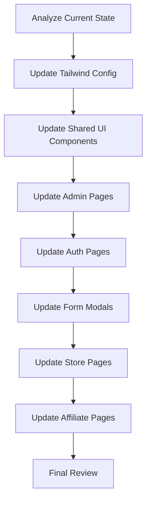

# Padding and Margin Uniformity Plan

## Executive Summary

This plan outlines the steps to standardize paddings and margins across all forms and pages in the Triad E-Commerce application to create a more cohesive and professional look.

---

## Current State Analysis

### Identified Inconsistencies

| Component            | Current Padding                         | Issue                                |
| -------------------- | --------------------------------------- | ------------------------------------ |
| Admin Pages          | `p-8`                                   | Too large compared to other elements |
| Login/Register Cards | `p-8`                                   | Different from form modals           |
| Form Modals Header   | `px-6 py-4` / `px-6 py-5`               | Inconsistent vertical padding        |
| Form Modals Body     | `p-6`                                   | Consistent ✓                         |
| Input Fields         | `px-3 py-2` / `px-4 py-3`               | Inconsistent horizontal padding      |
| Store Shop Page      | `px-6 sm:px-10 lg:px-16 py-10 sm:py-14` | Different breakpoints than admin     |
| Card Content         | `p-6`                                   | Consistent ✓                         |
| Card Header          | `px-6 py-3`                             | Consistent ✓                         |

### Key Files to Update

1. **Shared UI Components**: `Card.tsx`, `Input.tsx`, `Button.tsx`
2. **Admin Pages**: All pages in `src/features/admin/*/`
3. **Auth Pages**: Login, Register pages
4. **Form Modals**: All modal components
5. **Store Pages**: Shop, Cart pages
6. **Affiliate Pages**: Dashboard, Onboarding, Profile pages
7. **Tailwind Config**: Add spacing tokens

---

## Proposed Design System

### Standard Spacing Scale

| Token | Value | Usage                          |
| ----- | ----- | ------------------------------ |
| `xs`  | 4px   | Tight spacing, inline elements |
| `sm`  | 6px   | Between related elements       |
| `md`  | 8px   | Default form field gaps        |
| `lg`  | 12px  | Section spacing                |
| `xl`  | 16px  | Card padding, modal body       |
| `2xl` | 24px  | Page section gaps              |
| `3xl` | 32px  | Major section spacing          |
| `4xl` | 48px  | Page-level spacing             |

### Standard Patterns

#### Page Containers

- **Admin Pages**: `p-6` (24px) - consistent with Card padding
- **Store Pages**: `px-4 sm:px-6 lg:px-8 py-8` - responsive
- **Auth Pages**: Centered cards with `p-8` (32px)

#### Form Modals

- **Header**: `px-6 py-4` (24px horizontal, 16px vertical)
- **Body**: `p-6` (24px)
- **Footer**: `px-6 py-4` (24px horizontal, 16px vertical)
- **Form Fields**: `space-y-5` (20px gaps)

#### Input Fields

- **Height**: `py-3` (12px) for comfortable touch targets
- **Horizontal**: `px-4` (16px)
- **Label-Input Gap**: `gap-1` (4px)
- **Field Gap**: `space-y-5` (20px) in forms

#### Cards

- **Content Padding**: `p-6` (24px)
- **Header Padding**: `px-6 py-4` (24px horizontal, 16px vertical)
- **Footer Padding**: `px-6 py-4` (24px horizontal, 16px vertical)

---

## Implementation Steps

### Step 1: Update Tailwind Configuration

Add custom spacing tokens to `tailwind.config.ts`:

```ts
theme: {
  extend: {
    spacing: {
      'xs': '4px',
      'sm': '6px',
      'md': '8px',
      'lg': '12px',
      'xl': '16px',
      '2xl': '24px',
      '3xl': '32px',
      '4xl': '48px',
    }
  }
}
```

### Step 2: Update Shared UI Components

- **Card.tsx**: Update CardContent, CardHeader, CardFooter padding
- **Input.tsx**: Standardize input padding to `px-4 py-3`
- **Button.tsx**: Ensure consistent padding

### Step 3: Update Admin Pages

All admin pages should use `p-6` container:

- `AffiliatesPage.tsx`
- `AffiliateSalesPage.tsx`
- `ProductsPage.tsx`
- `OrdersPage.tsx`
- `StocksPage.tsx`
- `CoursesPage.tsx`
- `CommunityPage.tsx`
- `TestimonialsPage.tsx`
- `ImageLibraryPage.tsx`
- `DashboardPage.tsx`

### Step 4: Update Auth Pages

- Login page: Adjust card padding
- Register page: Adjust card padding

### Step 5: Update Form Modals

Standardize all form modals:

- Header: `px-6 py-4`
- Body: `p-6 space-y-5`
- Inputs: `px-4 py-3`

### Step 6: Update Store Pages

- Shop page: Use responsive `px-4 sm:px-6 lg:px-8 py-8`

### Step 7: Update Affiliate Pages

- Dashboard, Profile, Onboarding pages

---

## Mermaid Diagram: Implementation Flow



---

## Files Requiring Changes

### Shared Components

- `src/shared/components/ui/Card.tsx`
- `src/shared/components/ui/Input.tsx`
- `src/shared/components/ui/Button.tsx`

### Tailwind Config

- `tailwind.config.ts`

### Admin Features

- `src/features/admin/affiliates/AffiliatesPage.tsx`
- `src/features/admin/affiliate-sales/AffiliateSalesPage.tsx`
- `src/features/admin/products/ProductsPage.tsx`
- `src/features/admin/orders/OrdersPage.tsx`
- `src/features/admin/stocks/StocksPage.tsx`
- `src/features/admin/courses/CoursesPage.tsx`
- `src/features/admin/community/CommunityPage.tsx`
- `src/features/admin/testimonials/TestimonialsPage.tsx`
- `src/features/admin/image-library/ImageLibraryPage.tsx`
- `src/features/admin/dashboard/DashboardPage.tsx`

### Auth Pages

- `src/app/(auth)/login/page.tsx`
- `src/app/register/page.tsx`

### Form Modals

- `src/features/admin/affiliates/modals/InviteAffiliateModal.tsx`
- `src/features/admin/affiliates/modals/ManageProductsModal.tsx`
- `src/features/admin/courses/components/CourseFormModal.tsx`
- `src/features/admin/community/components/CommunityFormModal.tsx`
- `src/features/admin/image-library/components/ImageLibraryFormModal.tsx`
- And other admin form modals

### Store Pages

- `src/features/store/shop/ShopPage.tsx`
- `src/features/store/cart/CartPage.tsx`

### Affiliate Pages

- `src/features/affiliate/dashboard/AffiliateDashboardPage.tsx`
- `src/features/affiliate/profile/AffiliateProfilePage.tsx`
- `src/features/affiliate/onboarding/AffiliateOnboardingPage.tsx`

---

## Success Criteria

1. All pages use consistent container padding (`p-6` for admin, responsive for store)
2. All form modals follow the same padding pattern
3. All input fields have consistent sizing and padding
4. All cards have consistent internal spacing
5. Visual hierarchy is maintained with proper spacing between sections
6. Responsive design is preserved across all breakpoints
