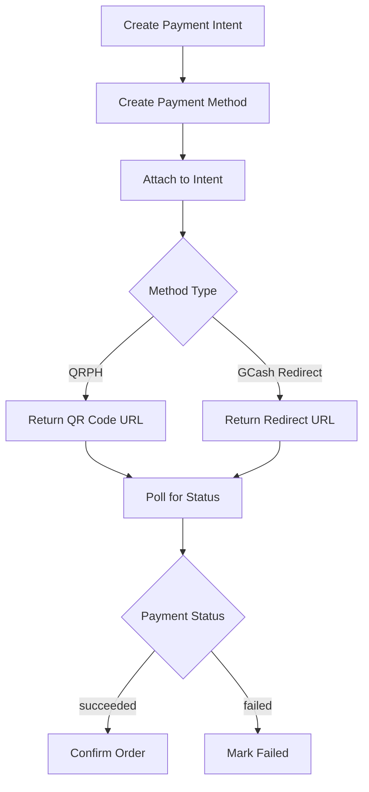

# PayMongo Payment Implementation Analysis & Plan

## Executive Summary

This document analyzes the current PayMongo payment implementation across the ecommerce platform and provides recommendations for best practices alignment. The platform uses **PayMongo QRPH (QR Code Payment)** for GCash transactions, which is implemented consistently across both checkout and affiliate registration flows.

---

## Current Implementation Analysis

### 1. Backend PayMongo Integration

The backend (Node.js/Express) implements PayMongo integration using the following flow:



**Key Backend Components:**

| Component                                                                | File                                          | Purpose |
| ------------------------------------------------------------------------ | --------------------------------------------- | ------- |
| [`paymongo.utils`](path-to-backend)                                      | Creates payment intents with QRPH allowed     |
| [`attachGCashToIntent`](path-to-backend)                                 | Creates payment method and attaches to intent |
| [`getPaymentIntentStatus`](path-to-backend)                              | Polls payment status                          |
| [`order.service.ts`](src/features/store/order/services/order.service.ts) | Orchestrates order placement                  |
| [`affiliate.service.ts`](path-to-backend)                                | Handles affiliate registration payments       |

### 2. Frontend Payment Flows

#### Checkout Modal (Order Payments)

- **Location:** [`CheckoutModal.tsx`](src/features/store/home/modals/CheckoutModal.tsx)
- **Payment Methods:** COD, GCash
- **Flow:** 3-step checkout (Cart → Shipping → Payment)
- **GCash:** Shows inline QR code with polling

#### Affiliate Onboarding (Registration Payment)

- **Location:** [`AffiliateOnboardingPage.tsx`](src/features/affiliate/onboarding/AffiliateOnboardingPage.tsx)
- **Amount:** ₱999 one-time registration fee
- **Flow:** Full-page QR code display
- **Polling:** Every 3 seconds with manual "I've Completed Payment" button

#### Checkout Callback Page

- **Location:** [`checkout/callback/page.tsx`](src/app/checkout/callback/page.tsx)
- **Purpose:** Handles redirect after payment
- **States:** checking, success, failed, pending, error

---

## Best Practices Evaluation

### ✅ Already Implemented Correctly

1. **QRPH Payment Method**: Uses `payment_method_allowed: ["qrph"]` as specified
2. **Amount Conversion**: Backend correctly converts PHP to centavos (`amount * 100`)
3. **Client Key Handling**: Properly manages client_key for payment verification
4. **Stock Management**: Delays stock deduction until payment confirmation (prevents phantom holds)
5. **Webhook Support**: Backend has webhook endpoint for automatic confirmation
6. **Idempotency**: Backend checks for `alreadyConfirmed` to prevent double-processing

### ⚠️ Areas for Improvement

| Issue                       | Location                | Severity | Recommendation                               |
| --------------------------- | ----------------------- | -------- | -------------------------------------------- |
| No max polling limit        | AffiliateOnboardingPage | Medium   | Add max attempts to prevent infinite polling |
| Inconsistent error handling | Both flows              | Low      | Standardize error messages                   |
| Missing payment timeout     | Both flows              | Low      | Show timeout message after ~5 minutes        |
| No retry mechanism          | QR display              | Low      | Add "Try Again" button for failed payments   |
| Hardcoded amount            | AffiliateOnboardingPage | Low      | Use env variable for registration fee        |

---

## Recommended Implementation Plan

### Phase 1: Align Affiliate Payment with Checkout Best Practices

1. **Add Max Polling Attempts**
   - Location: [`AffiliateOnboardingPage.tsx`](src/features/affiliate/onboarding/AffiliateOnboardingPage.tsx)
   - Change: Add `maxAttempts = 100` (matches checkout modal)
   - On timeout: Show "Payment pending - check back later" message

2. **Standardize Status States**
   - Align affiliate callback states with checkout callback
   - Add: `pending` state for timeout scenarios

3. **Add Timeout Handling**
   - Show timeout message after ~5 minutes of polling
   - Provide clear next steps to user

### Phase 2: Enhance User Experience

1. **Add "I've Completed Payment" Button** (already exists ✓)
2. **Improve Error Messages**
   - Use consistent error handling across flows
   - Show actionable error messages

3. **Loading State Improvements**
   - Show skeleton/spinner during payment initiation
   - Disable multiple payment attempts

### Phase 3: Backend Optimizations (if needed)

1. **Payment Expiry**: Consider adding payment intent expiry (e.g., 30 minutes)
2. **Graceful Degradation**: Handle PayMongo API failures gracefully
3. **Logging Enhancement**: Add request/response logging for debugging

---

## Implementation Checklist

```markdown
- [ ] Add maxAttempts constant to AffiliateOnboardingPage
- [ ] Implement timeout state handling
- [ ] Align error message formatting with checkout callback
- [ ] Add pending state for payment timeouts
- [ ] Test payment flow end-to-end
- [ ] Verify webhook integration works correctly
```

---

## PayMongo API Reference

Based on the provided backend code, the platform uses:

### Endpoints Used

| Endpoint                      | Method | Purpose                            |
| ----------------------------- | ------ | ---------------------------------- |
| `/payment_intents`            | POST   | Create payment intent              |
| `/payment_methods`            | POST   | Create payment method (type: qrph) |
| `/payment_intents/:id/attach` | POST   | Attach method to intent            |
| `/payment_intents/:id`        | GET    | Get payment status                 |

### Payment Method

```typescript
// Current implementation uses QRPH
payment_method_allowed: ["qrph"];
```

### Response Types

```typescript
interface PayMongoAttachResponse {
  data: {
    attributes: {
      status: string;
      next_action?: {
        type: "consume_qr" | "redirect";
        redirect?: { url: string };
        code?: { id: string; image_url: string };
      };
    };
  };
}
```

---

## Conclusion

The current PayMongo implementation follows best practices for QRPH payments. The affiliate onboarding flow should be updated to match the checkout modal's polling behavior (max attempts, timeout handling) for consistency. All payment flows correctly use the same PayMongo utility functions, ensuring consistent behavior across the platform.

**Key Action Items:**

1. Add max polling attempts to affiliate onboarding
2. Implement timeout handling
3. Standardize error states across flows
