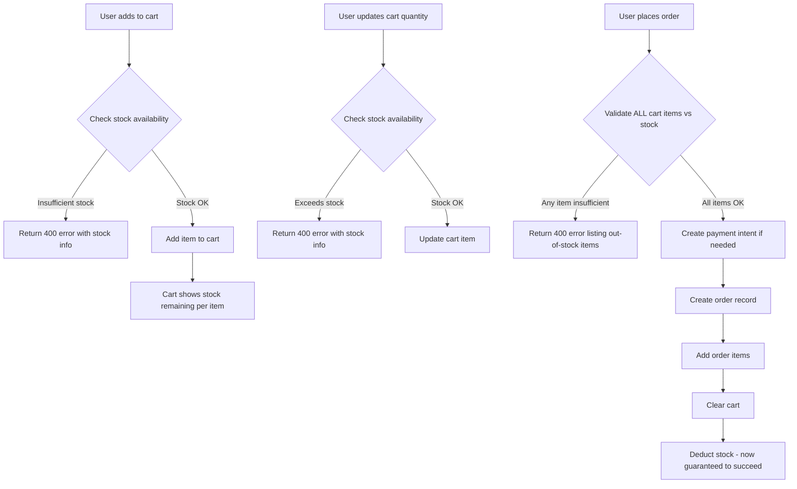

# Stock Deduction, Validation & Shipping Fix Plan

## Overview

This plan covers both **backend** and **frontend** changes needed to:

1. Properly deduct stock when an order is saved
2. Validate stock in the cart (prevent over-ordering)
3. Show accurate remaining stock counts on product and cart pages

---

## Current State Analysis

### Backend (Confirmed)

- [`PlaceOrder.deductStock()`](../src/application/use-cases/order/PlaceOrder.ts:302) — stock IS deducted after order is saved, but **silently warns** instead of throwing when stock is insufficient.
- [`SupabaseStockRepository.upsert()`](../src/infrastructure/database/supabase/SupabaseStockRepository.ts:89) — correctly updates stock quantity.
- [`GetStockAvailabilityUseCase`](../src/application/use-cases/stocks/GetStockAvailability.ts:27) — returns `{ available: boolean }` only (no quantity).

### Frontend (Confirmed)

- [`ShopDetailPage.tsx`](../src/features/store/shop/ShopDetailPage.tsx) — fetches stock via `useShop` and shows stock labels (out of stock, low stock, in stock)
- [`ProductCard.tsx`](../src/features/store/shop/components/ProductCard.tsx) — shows stock labels and disables "Add to Cart" when out of stock or at capacity
- [`shop.service.ts`](../src/features/store/shop/services/shop.service.ts:28) — `getStockByProductId` calls `/api/stocks/availability/:productId` which returns `{ available: boolean }`, then converts it to `1` or `0` — **NOT the actual quantity!**
- [`CartItemRow.tsx`](../src/features/store/cart/components/CartItemRow.tsx) — quantity stepper has **no upper bound** — users can increase quantity beyond available stock
- [`CartStep.tsx`](../src/features/store/order/components/CartStep.tsx:90) — allows quantity increase with **no cap**

---

## Problems Found

### Backend Problems

#### Problem 1: `SupabaseStockRepository.findByProductId` throws instead of returning null

[`findByProductId()`](../src/infrastructure/database/supabase/SupabaseStockRepository.ts:75) uses `.single()` which throws a 404 `AppError` when no stock record exists. This means `PlaceOrder.deductStock()` silently catches the error and **skips deduction** — stock is never deducted for products with no stock record.

#### Problem 2: No stock validation before order creation in `PlaceOrder`

[`PlaceOrder.execute()`](../src/application/use-cases/order/PlaceOrder.ts:94) deducts stock **after** the order is created and payment intent is generated. If stock is insufficient, the order is already saved and payment may already be initiated. Stock validation must happen **before** order creation.

#### Problem 3: No stock check in `AddToCart`

[`AddToCartUseCase.execute()`](../src/application/use-cases/cart/AddToCart.ts:51) does not check if the requested quantity is available in stock. Users can add more items than available.

#### Problem 4: No stock check in `UpdateCartItem`

[`UpdateCartItemUseCase.execute()`](../src/application/use-cases/cart/UpdateCartItem.ts:50) does not validate that the new quantity is within available stock.

#### Problem 5: `GetStockAvailability` only returns boolean

[`GetStockAvailabilityOutput`](../src/application/use-cases/stocks/GetStockAvailability.ts:20) only returns `{ available: boolean }`. It should also return `quantity` so the frontend can show "X items left".

#### Problem 6: Cart items don't include stock info

[`SupabaseCartRepository.findAllByOwner()`](../src/infrastructure/database/supabase/SupabaseCartRepository.ts:33) does not join stock data. The cart response doesn't tell the frontend how many items are left in stock for each cart item.

### Frontend Problems

#### Problem 7: `getStockByProductId` returns boolean (0 or 1), not actual quantity

[`shop.service.ts`](../src/features/store/shop/services/shop.service.ts:28) converts the `available` boolean to `1` or `0`. The shop page shows "1 in stock" for any available product.

#### Problem 8: Cart quantity stepper has no upper bound

[`CartItemRow.tsx`](../src/features/store/cart/components/CartItemRow.tsx) and [`CartStep.tsx`](../src/features/store/order/components/CartStep.tsx) allow unlimited quantity increases.

#### Problem 9: No stock warning in cart or checkout

No visual feedback when cart items exceed available stock.

---

## Architecture Flow



---

## Implementation Plan

### BACKEND Changes

#### Step 1 — Fix `SupabaseStockRepository.findByProductId`

**File:** [`src/infrastructure/database/supabase/SupabaseStockRepository.ts`](../src/infrastructure/database/supabase/SupabaseStockRepository.ts)

Change `.single()` to `.maybeSingle()` and return `null` instead of throwing when no record is found:

```typescript
async findByProductId(productId: string): Promise<any> {
  const { data, error } = await supabaseAdmin
    .from("stocks")
    .select("*")
    .eq("product_id", productId)
    .maybeSingle();

  if (error) throw new AppError(error.message, 500);
  return data ?? null;
}
```

---

#### Step 2 — Add stock validation in `PlaceOrder` (before order creation)

**File:** [`src/application/use-cases/order/PlaceOrder.ts`](../src/application/use-cases/order/PlaceOrder.ts)

Add a new private method `validateStock()` that checks all cart items against available stock **before** creating the payment intent or order. Insert the call as step 2.5 (after calculating totals, before handling payment):

```typescript
// 3.5 Validate stock availability for all items
await this.validateStock(orderItems);
```

New method:

```typescript
private async validateStock(
  orderItems: { productId: string; quantity: number; unitPrice: number }[]
): Promise<void> {
  const insufficientItems: string[] = [];

  for (const item of orderItems) {
    const stock = await this.stockRepository.findByProductId(item.productId);
    const available = stock?.quantity ?? 0;
    if (available < item.quantity) {
      insufficientItems.push(
        `Product ${item.productId}: requested ${item.quantity}, available ${available}`
      );
    }
  }

  if (insufficientItems.length > 0) {
    throw new AppError(
      `Insufficient stock for: ${insufficientItems.join("; ")}`,
      400
    );
  }
}
```

Also fix `deductStock()` to handle missing stock records gracefully (since `findByProductId` now returns `null` instead of throwing):

```typescript
private async deductStock(...): Promise<void> {
  for (const item of orderItems) {
    const currentStock = await this.stockRepository.findByProductId(item.productId);
    const newQty = (currentStock?.quantity ?? 0) - item.quantity;
    await this.stockRepository.upsert(item.productId, {
      quantity: Math.max(0, newQty),
    });
  }
}
```

---

#### Step 3 — Add stock validation in `AddToCart`

**File:** [`src/application/use-cases/cart/AddToCart.ts`](../src/application/use-cases/cart/AddToCart.ts)

Inject `IStockRepository` and check stock before upserting. Account for items already in the cart:

```typescript
export class AddToCartUseCase {
  private readonly cartRepository: ICartRepository;
  private readonly stockRepository: IStockRepository;

  constructor(
    cartRepository?: ICartRepository,
    stockRepository?: IStockRepository,
  ) {
    this.cartRepository =
      cartRepository ?? resolve<ICartRepository>(TOKENS.ICartRepository);
    this.stockRepository =
      stockRepository ?? resolve<IStockRepository>(TOKENS.IStockRepository);
  }

  async execute(input: AddToCartInput): Promise<AddToCartOutput> {
    // ... owner resolution ...

    // Check existing cart quantity for this product
    const existing = await this.cartRepository.findItem(owner, input.productId);
    const existingQty = existing?.quantity ?? 0;
    const totalRequested = existingQty + input.quantity;

    // Check stock
    const stock = await this.stockRepository.findByProductId(input.productId);
    const available = stock?.quantity ?? 0;

    if (available === 0) {
      throw new AppError("This product is out of stock", 400);
    }
    if (totalRequested > available) {
      throw new AppError(
        `Only ${available} item(s) available in stock. You already have ${existingQty} in your cart.`,
        400,
      );
    }

    // ... proceed with upsert ...
  }
}
```

---

#### Step 4 — Add stock validation in `UpdateCartItem`

**File:** [`src/application/use-cases/cart/UpdateCartItem.ts`](../src/application/use-cases/cart/UpdateCartItem.ts)

Inject `IStockRepository` and validate the new quantity against available stock:

```typescript
export class UpdateCartItemUseCase {
  private readonly cartRepository: ICartRepository;
  private readonly stockRepository: IStockRepository;

  // ... constructor with stockRepository injection ...

  async execute(input: UpdateCartItemInput): Promise<UpdateCartItemOutput> {
    // ... owner resolution ...

    // Get the cart item to find productId
    const cartItems = await this.cartRepository.findAllByOwner(owner);
    const cartItem = cartItems.find((i) => i.id === input.itemId);
    if (!cartItem) {
      throw new AppError("Cart item not found", 404);
    }

    // Check stock
    const stock = await this.stockRepository.findByProductId(
      cartItem.productId,
    );
    const available = stock?.quantity ?? 0;

    if (input.quantity > available) {
      throw new AppError(`Only ${available} item(s) available in stock`, 400);
    }

    // ... proceed with updateQuantity ...
  }
}
```

---

#### Step 5 — Update `GetStockAvailability` to return quantity

**File:** [`src/application/use-cases/stocks/GetStockAvailability.ts`](../src/application/use-cases/stocks/GetStockAvailability.ts)

Update the output to include `quantity`:

```typescript
export interface GetStockAvailabilityOutput {
  available: boolean;
  quantity: number;
}

// In execute():
return {
  available: (stock?.quantity ?? 0) > 0,
  quantity: stock?.quantity ?? 0,
};
```

---

#### Step 6 — Include stock info in cart items

**File:** [`src/domain/interfaces/ICartRepository.ts`](../src/domain/interfaces/ICartRepository.ts)

Add `stock` to the `CartItem.product` interface:

```typescript
export interface CartItem {
  // ...
  product?: {
    id: string;
    name: string;
    price: number;
    imageUrl: string | null;
    images?: Array<{ id: string; url: string; position: number }>;
    stock?: {
      quantity: number;
      available: boolean;
    };
  };
}
```

**File:** [`src/infrastructure/database/supabase/SupabaseCartRepository.ts`](../src/infrastructure/database/supabase/SupabaseCartRepository.ts)

Update `findAllByOwner` query to join stocks:

```typescript
.select(`
  *,
  product:products (
    id,
    name,
    price,
    image_url,
    images:product_images (
      id,
      url,
      position
    ),
    stock:stocks (
      quantity
    )
  )
`)
```

And map the stock data in the response:

```typescript
product: item.product ? {
  ...item.product,
  imageUrl: item.product.image_url,
  images: item.product.images,
  stock: item.product.stock
    ? {
        quantity: item.product.stock.quantity,
        available: item.product.stock.quantity > 0,
      }
    : { quantity: 0, available: false },
} : undefined,
```

---

### FRONTEND Changes

#### Step 7 — Fix `shop.service.ts` to use real quantity

**File:** [`src/features/store/shop/services/shop.service.ts`](../src/features/store/shop/services/shop.service.ts)

Since `GetStockAvailability` now returns `{ available: boolean, quantity: number }`, update the service to use the real quantity:

```typescript
async getStockByProductId(productId: string): Promise<number> {
  try {
    const { data } = await productsApi.getStockAvailability(productId);
    // Now returns { available: boolean, quantity: number }
    return (data as any).data?.quantity ?? (data as any).quantity ?? 0;
  } catch {
    return 0;
  }
}
```

Also update the `productsApi.getStockAvailability` return type:
**File:** [`src/infrastructure/api/products.api.ts`](../src/infrastructure/api/products.api.ts)

```typescript
getStockAvailability: (productId: string) =>
  apiClient.get<{ available: boolean; quantity: number }>(
    `/api/stocks/availability/${productId}`,
  ),
```

---

#### Step 8 — Update `CartProduct` type to include stock

**File:** [`src/types/cart.types.ts`](../src/types/cart.types.ts)

```typescript
export interface CartProduct {
  id: string;
  name: string;
  price: number;
  image_url: string | null;
  images?: { url: string; position: number }[];
  stock?: number | null; // ← ADD: actual stock quantity from backend
}
```

---

#### Step 9 — Update `ModalCartItem` type to include stock

**File:** [`src/types/checkout.types.ts`](../src/types/checkout.types.ts)

```typescript
export interface ModalCartItem {
  id: string;
  name: string;
  price: number;
  quantity: number;
  image?: string;
  stock?: number | null; // ← ADD: for stock cap in CartStep
}
```

---

#### Step 10 — Update `CartItemRow` to show stock and cap stepper

**File:** [`src/features/store/cart/components/CartItemRow.tsx`](../src/features/store/cart/components/CartItemRow.tsx)

Changes:

- Show remaining stock count below product name (e.g., "5 left in stock" in green, "Only 2 left!" in amber, "Out of stock" in red)
- Disable the `+` button when `item.quantity >= item.product.stock`
- Show a warning badge if `item.product.stock === 0`

```tsx
const stock = item.product.stock ?? null;
const outOfStock = stock !== null && stock === 0;
const atMax = stock !== null && item.quantity >= stock;
const lowStock = stock !== null && stock > 0 && stock <= getLowStockThreshold(stock);

// In the + button:
<button
  onClick={() => onUpdate(item.id, item.quantity + 1)}
  disabled={atMax || outOfStock}
  ...
>
```

---

#### Step 11 — Update `CartPage` to show stock warnings

**File:** [`src/features/store/cart/CartPage.tsx`](../src/features/store/cart/CartPage.tsx)

- Compute `hasStockIssues = cart.items.some(i => i.product.stock !== null && i.quantity > (i.product.stock ?? Infinity))`
- Show a warning banner: "Some items in your cart have insufficient stock. Please review quantities."
- The "Proceed to Checkout" button in `CartSummary` should be disabled if `hasStockIssues`

Pass `hasStockIssues` to `CartSummary` as a prop.

---

#### Step 12 — Update `CartStep` to show stock warnings and cap stepper

**File:** [`src/features/store/order/components/CartStep.tsx`](../src/features/store/order/components/CartStep.tsx)

- Cap the `+` button at `item.stock` if defined
- Show stock warning label per item (e.g., "Only 2 left!" in amber)
- Show a red warning if `item.quantity > item.stock`

```tsx
const atMax = item.stock != null && item.quantity >= item.stock;
const overStock = item.stock != null && item.quantity > item.stock;

// + button:
<button
  onClick={() => onQtyChange(item.id, item.quantity + 1)}
  disabled={item.quantity <= 1 || atMax}
  ...
>

// Stock label:
{item.stock != null && (
  <p className={`text-[10px] font-semibold ${overStock ? 'text-red-500' : 'text-amber-500'}`}>
    {overStock ? `Exceeds stock (${item.stock} available)` : `${item.stock} left`}
  </p>
)}
```

---

#### Step 13 — Update `OrderPage` to pass stock and block order if OOS

**File:** [`src/features/store/order/OrderPage.tsx`](../src/features/store/order/OrderPage.tsx)

When building `items` from `cart.items`, include the stock:

```typescript
const items: ModalCartItem[] = cart.items.map((item) => ({
  id: item.id,
  name: item.product.name,
  price: item.product.price,
  quantity: item.quantity,
  image: item.product.images?.[0]?.url ?? item.product.image_url ?? undefined,
  stock: item.product.stock ?? null, // ← ADD
}));
```

Block the "Place Order" button if any item quantity exceeds its stock:

```typescript
const hasStockIssue = items.some(
  (item) => item.stock != null && item.quantity > item.stock,
);

// In getCanContinue():
if (step === 3) return !hasStockIssue;
```

---

#### Step 14 — Update `CheckoutModal` similarly

**File:** [`src/features/store/home/modals/CheckoutModal.tsx`](../src/features/store/home/modals/CheckoutModal.tsx)

Same changes as `OrderPage` — pass stock to `CartStep` and block checkout if stock is insufficient.

---

#### Step 15 — Handle backend stock error in `useOrder`

**File:** [`src/features/store/order/hooks/useOrder.ts`](../src/features/store/order/hooks/useOrder.ts)

When the backend returns a 400 error about insufficient stock, extract and display a user-friendly message:

```typescript
} catch (err: any) {
  const message = err?.response?.data?.message ?? err?.message ?? "Failed to place order";
  const isStockError = message.toLowerCase().includes("stock") ||
                       message.toLowerCase().includes("insufficient");
  setError(
    isStockError
      ? "Some items in your cart are no longer available in the requested quantity. Please review your cart."
      : "Failed to place order. Please try again."
  );
  throw err;
}
```

---

## Summary of Files to Change

### Backend Files

| File                                                                                               | Change                                                                                 |
| -------------------------------------------------------------------------------------------------- | -------------------------------------------------------------------------------------- |
| [`SupabaseStockRepository.ts`](../src/infrastructure/database/supabase/SupabaseStockRepository.ts) | Use `.maybeSingle()` in `findByProductId`, return `null` instead of throwing           |
| [`PlaceOrder.ts`](../src/application/use-cases/order/PlaceOrder.ts)                                | Add `validateStock()` method called before payment/order creation; fix `deductStock()` |
| [`AddToCart.ts`](../src/application/use-cases/cart/AddToCart.ts)                                   | Inject `IStockRepository`, validate stock + existing cart qty before adding            |
| [`UpdateCartItem.ts`](../src/application/use-cases/cart/UpdateCartItem.ts)                         | Inject `IStockRepository`, validate new quantity against stock                         |
| [`GetStockAvailability.ts`](../src/application/use-cases/stocks/GetStockAvailability.ts)           | Return `quantity` in addition to `available` boolean                                   |
| [`ICartRepository.ts`](../src/domain/interfaces/ICartRepository.ts)                                | Add `stock` field to `CartItem.product` interface                                      |
| [`SupabaseCartRepository.ts`](../src/infrastructure/database/supabase/SupabaseCartRepository.ts)   | Join `stocks` table in `findAllByOwner`, map stock data                                |

### Frontend Files

| File                                                                                                          | Change                                                          |
| ------------------------------------------------------------------------------------------------------------- | --------------------------------------------------------------- |
| [`src/infrastructure/api/products.api.ts`](../src/infrastructure/api/products.api.ts)                         | Update `getStockAvailability` return type to include `quantity` |
| [`src/features/store/shop/services/shop.service.ts`](../src/features/store/shop/services/shop.service.ts)     | Fix `getStockByProductId` to return real quantity from response |
| [`src/types/cart.types.ts`](../src/types/cart.types.ts)                                                       | Add `stock` field to `CartProduct`                              |
| [`src/types/checkout.types.ts`](../src/types/checkout.types.ts)                                               | Add `stock` field to `ModalCartItem`                            |
| [`src/features/store/cart/components/CartItemRow.tsx`](../src/features/store/cart/components/CartItemRow.tsx) | Show stock count, cap stepper at stock limit, show OOS warning  |
| [`src/features/store/cart/CartPage.tsx`](../src/features/store/cart/CartPage.tsx)                             | Show stock warning banner, disable checkout if OOS              |
| [`src/features/store/order/components/CartStep.tsx`](../src/features/store/order/components/CartStep.tsx)     | Cap qty stepper at stock, show stock warnings                   |
| [`src/features/store/order/OrderPage.tsx`](../src/features/store/order/OrderPage.tsx)                         | Pass stock to items, block order if OOS                         |
| [`src/features/store/home/modals/CheckoutModal.tsx`](../src/features/store/home/modals/CheckoutModal.tsx)     | Pass stock to items, block order if OOS                         |
| [`src/features/store/order/hooks/useOrder.ts`](../src/features/store/order/hooks/useOrder.ts)                 | Handle stock error response from backend                        |

---

## Stock Label Behavior (Frontend)

| Condition                               | Label          | Color |
| --------------------------------------- | -------------- | ----- |
| `stock === 0`                           | "Out of stock" | Red   |
| `stock > 0 && cartQty >= stock`         | "Max in cart"  | Red   |
| `stock > 0 && stock <= threshold (20%)` | "Only N left!" | Amber |
| `stock > 0`                             | "N in stock"   | Green |

The `getStockLabel` in [`stock.utils.ts`](../src/utils/stock.utils.ts) already handles this correctly — it just needs the real `stock` quantity (not the boolean 0/1) to work properly.
