# Implementation Plan: Twcako.com Design + Dark + Orange Theme + Animations

## Overview

This plan provides a comprehensive implementation strategy to:

1. Copy the layout, design patterns, AND animations from twcako.com
2. Retain the dark + orange theme throughout the application
3. Fix all purple color remnants by replacing them with orange
4. Ensure responsive design across all pages

---

## Animation Patterns to Implement

### Existing Animations in Project

The project already has some animation hooks and utilities:

- `src/features/store/home/hooks/useFadeIn.ts` - Fade-in animations
- `src/features/store/home/hooks/useScrolled.ts` - Scroll detection
- `src/features/store/home/hooks/useScrollToTopVisible.ts` - Scroll to top visibility

### Recommended Animation Additions

| Animation Type    | Target Elements     | Implementation                             |
| ----------------- | ------------------- | ------------------------------------------ |
| Fade-in on scroll | Section elements    | Intersection Observer + opacity transition |
| Slide-up entrance | Hero content, cards | translateY + opacity                       |
| Scale on hover    | Buttons, cards      | scale transform + shadow                   |
| Smooth scroll     | Navigation links    | scroll-behavior: smooth                    |
| Stagger animation | Lists, grids        | delay + animation-delay                    |

### CSS Animation Classes to Add

```css
/* Fade-in slide-up */
.animate-fade-in-up {
  animation: fadeInUp 0.6s ease-out forwards;
}

@keyframes fadeInUp {
  from {
    opacity: 0;
    transform: translateY(20px);
  }
  to {
    opacity: 1;
    transform: translateY(0);
  }
}

/* Stagger children */
.stagger-children > * {
  animation: fadeInUp 0.5s ease-out forwards;
  opacity: 0;
}

.stagger-children > *:nth-child(1) {
  animation-delay: 0ms;
}
.stagger-children > *:nth-child(2) {
  animation-delay: 100ms;
}
.stagger-children > *:nth-child(3) {
  animation-delay: 200ms;
}
.stagger-children > *:nth-child(4) {
  animation-delay: 300ms;
}
.stagger-children > *:nth-child(5) {
  animation-delay: 400ms;
}
.stagger-children > *:nth-child(6) {
  animation-delay: 500ms;
}

/* Hover scale */
.hover-scale {
  transition:
    transform 0.2s ease,
    box-shadow 0.2s ease;
}
.hover-scale:hover {
  transform: scale(1.02);
  box-shadow: 0 10px 25px rgba(249, 115, 22, 0.15);
}
```

---

## Current Design Pattern Analysis

### Store Pages Already Following the Pattern ✅

The following pages already implement the dark hero + white content pattern:

| Page           | File                                                   | Status                       |
| -------------- | ------------------------------------------------------ | ---------------------------- |
| Shop           | `src/features/store/shop/ShopPage.tsx`                 | ✅ Dark hero + white content |
| Cart           | `src/features/store/cart/CartPage.tsx`                 | ✅ Dark hero + white content |
| Product Detail | `src/features/store/shop/ShopDetailPage.tsx`           | ✅ Dark hero + white content |
| Orders         | `src/app/(store)/orders/page.tsx`                      | ✅ Dark hero + white content |
| Testimonials   | `src/features/store/testimonials/TestimonialsPage.tsx` | ✅ Dark hero + white content |

### Issues Found ⚠️

1. **Purple remnants in bundle selector** (ShopDetailPage.tsx)
2. **Purple in payment success modal** (OrderPage.tsx)
3. **Spinners using wrong colors** (TestimonialsPage)
4. **Inconsistent benefit icons** (HomePage)
5. **Hover states using purple** (multiple components)

---

## Design Pattern: Twcako.com Layout

### Standard Page Structure

```mermaid
flowchart TB
    A[Dark Hero Section] --> B[White Content Card]
    B --> C[Optional Below Sections]

    A --> A1["bg-gradient-to-br from-gray-950 via-gray-900 to-gray-950"]
    A --> A2["py-12 sm:py-16 max-w-[1440px] mx-auto"]
    A --> A3["Page Title - White text"]
    A --> A4["Optional subtitle - gray-300 text"]

    B --> B1["bg-white rounded-t-3xl -mt-8"]
    B --> B2["px-6 sm:px-10 lg:px-16 py-8 sm:py-12"]
    B --> B3["Shadow effects"]

    style A fill:#1a1a2e,stroke:#f97316
    style B fill:#ffffff,stroke:#ddd
```



### Color Palette

| Element         | Class        | Hex     |
| --------------- | ------------ | ------- |
| Primary Orange  | `orange-500` | #f97316 |
| Orange Hover    | `orange-600` | #ea580c |
| Orange Light    | `orange-400` | #fb923c |
| Orange Tint     | `orange-50`  | #fff7ed |
| Dark Background | `gray-950`   | #030712 |
| Dark Secondary  | `gray-900`   | #111827 |
| Text on Dark    | `white`      | #ffffff |
| Text Secondary  | `gray-300`   | #d1d5db |

---

## Implementation Tasks

### Phase 1: Fix Critical Purple Remnants

#### 1.1 ShopDetailPage Bundle Selector

**File:** `src/features/store/shop/ShopDetailPage.tsx`
**Lines:** 348-365

| Line | Current                   | Replace With              |
| ---- | ------------------------- | ------------------------- |
| 350  | `border-purple-600`       | `border-orange-500`       |
| 351  | `hover:border-purple-400` | `hover:border-orange-400` |
| 360  | `text-purple-200`         | `text-orange-200`         |

#### 1.2 OrderPage Payment Success Modal

**File:** `src/features/store/order/OrderPage.tsx`
**Lines:** 52-58

| Line | Current                                             | Replace With                                        |
| ---- | --------------------------------------------------- | --------------------------------------------------- |
| 55   | `linear-gradient(135deg, #7c3aed 0%, #a855f7 100%)` | `linear-gradient(135deg, #f97316 0%, #fb923c 100%)` |
| 56   | `rgba(124,58,237,0.35)`                             | `rgba(249,115,22,0.35)`                             |

#### 1.3 OrderPage Status Ring

**File:** `src/features/store/order/OrderPage.tsx`
**Line:** 238

| Current           | Replace With      |
| ----------------- | ----------------- |
| `ring-purple-100` | `ring-orange-100` |

#### 1.4 OrderPage Back Button

**File:** `src/features/store/order/OrderPage.tsx`
**Line:** 410

| Current                   | Replace With              |
| ------------------------- | ------------------------- |
| `hover:border-purple-300` | `hover:border-orange-300` |

### Phase 2: Fix Component Purple Hover States

#### 2.1 HeroSection.tsx

**File:** `src/features/store/home/components/HeroSection.tsx`
**Line:** 95

| Current                   | Replace With              |
| ------------------------- | ------------------------- |
| `hover:border-purple-300` | `hover:border-orange-300` |

#### 2.2 ProductCard.tsx

**File:** `src/features/store/shop/components/ProductCard.tsx`
**Line:** 182

| Current                   | Replace With              |
| ------------------------- | ------------------------- |
| `hover:border-purple-300` | `hover:border-orange-300` |

#### 2.3 ProductGallery.tsx

**File:** `src/features/store/shop/components/ProductGallery.tsx`
**Line:** 98

| Current             | Replace With        |
| ------------------- | ------------------- |
| `border-purple-500` | `border-orange-500` |

#### 2.4 ShopFilters.tsx

**File:** `src/features/store/shop/components/ShopFilters.tsx`
**Line:** 67

| Current                   | Replace With              |
| ------------------------- | ------------------------- |
| `hover:border-purple-300` | `hover:border-orange-300` |

#### 2.5 ShopPagination.tsx (3 instances)

**File:** `src/features/store/shop/components/ShopPagination.tsx`
**Lines:** 30, 48, 60

| Current                   | Replace With              |
| ------------------------- | ------------------------- |
| `hover:border-purple-300` | `hover:border-orange-300` |

#### 2.6 TestimonialsSection.tsx

**File:** `src/features/store/home/components/TestimonialsSection.tsx`
**Lines:** 62, 101

| Line | Current                   | Replace With              |
| ---- | ------------------------- | ------------------------- |
| 62   | `fill-purple-500`         | `fill-orange-500`         |
| 101  | `hover:border-purple-300` | `hover:border-orange-300` |

#### 2.7 Trustbar.tsx

**File:** `src/features/store/home/components/Trustbar.tsx`
**Line:** 27

| Current                   | Replace With              |
| ------------------------- | ------------------------- |
| `hover:border-purple-300` | `hover:border-orange-300` |

#### 2.8 YoutubeTestimonials.tsx (2 instances)

**File:** `src/features/store/shop/components/YoutubeTestimonials.tsx`
**Lines:** 124, 146

| Current                   | Replace With              |
| ------------------------- | ------------------------- |
| `hover:border-purple-300` | `hover:border-orange-300` |

#### 2.9 FaqSection.tsx

**File:** `src/features/store/shop/components/FaqSection.tsx`
**Line:** 60

| Current             | Replace With        |
| ------------------- | ------------------- |
| `border-purple-300` | `border-orange-300` |

#### 2.10 CartStep.tsx (2 instances)

**File:** `src/features/store/order/components/CartStep.tsx`
**Lines:** 161, 173

| Current                   | Replace With              |
| ------------------------- | ------------------------- |
| `hover:border-purple-300` | `hover:border-orange-300` |

#### 2.11 PaymentStep.tsx (2 instances)

**File:** `src/features/store/order/components/PaymentStep.tsx`
**Lines:** 57, 78

| Line | Current             | Replace With        |
| ---- | ------------------- | ------------------- |
| 57   | `border-purple-400` | `border-orange-400` |
| 78   | `border-purple-600` | `border-orange-600` |

#### 2.12 ShippingStep.tsx

**File:** `src/features/store/order/components/ShippingStep.tsx`
**Line:** 30

| Current                   | Replace With              |
| ------------------------- | ------------------------- |
| `focus:border-purple-300` | `focus:border-orange-300` |

#### 2.13 CartEmpty.tsx

**File:** `src/features/store/cart/components/CartEmpty.tsx`
**Line:** 10

| Current           | Replace With      |
| ----------------- | ----------------- |
| `text-purple-300` | `text-orange-300` |

#### 2.14 HomePrimitives.tsx

**File:** `src/features/store/home/components/HomePrimitives.tsx`
**Line:** 20

| Current           | Replace With      |
| ----------------- | ----------------- |
| `fill-purple-500` | `fill-orange-500` |

### Phase 3: Fix Spinners & Loading States

#### 3.1 TestimonialsPage Loading Spinner

**File:** `src/features/store/testimonials/TestimonialsPage.tsx`
**Line:** 27

| Current            | Replace With      |
| ------------------ | ----------------- |
| `text-emerald-500` | `text-orange-500` |

### Phase 4: Design Consistency Improvements

#### 4.1 TrustSection Purple Text

**File:** `src/features/store/home/components/TrustSection.tsx`
**Line:** 27

| Current           | Replace With      |
| ----------------- | ----------------- |
| `text-purple-100` | `text-orange-100` |

#### 4.2 MoneyBackGuarantee Purple Blob

**File:** `src/features/store/shop/components/MoneyBackGuarantee.tsx`
**Line:** 12

| Current            | Replace With       |
| ------------------ | ------------------ |
| `bg-purple-200/25` | `bg-orange-200/25` |

### Phase 5: HomePage Benefits Section

#### 5.1 Standardize All Benefits to Orange Theme

**File:** `src/features/store/home/HomePage.tsx`
**Lines:** 24-68

Current pattern uses mixed colors:

- Package: orange-600 ✅
- Bot: blue-600 ❌
- TrendingUp: emerald-600 ❌
- BookOpen: amber-600 ❌
- Users: orange-600 ✅
- Wallet: indigo-600 ❌

All should use orange theme:

```tsx
{
  icon: IconType;
  title: string;
  description: string;
  color: "text-orange-600";
  bg: "bg-orange-50";
}
```

---

## Summary of Changes

### Files to Modify (25 files)

| #   | File                                                         | Changes    |
| --- | ------------------------------------------------------------ | ---------- |
| 1   | `src/features/store/shop/ShopDetailPage.tsx`                 | 3 changes  |
| 2   | `src/features/store/order/OrderPage.tsx`                     | 4 changes  |
| 3   | `src/features/store/home/components/HeroSection.tsx`         | 1 change   |
| 4   | `src/features/store/home/components/HomePrimitives.tsx`      | 1 change   |
| 5   | `src/features/store/home/components/Trustbar.tsx`            | 1 change   |
| 6   | `src/features/store/home/components/TrustSection.tsx`        | 1 change   |
| 7   | `src/features/store/home/components/TestimonialsSection.tsx` | 2 changes  |
| 8   | `src/features/store/shop/components/ProductCard.tsx`         | 1 change   |
| 9   | `src/features/store/shop/components/ProductGallery.tsx`      | 1 change   |
| 10  | `src/features/store/shop/components/FaqSection.tsx`          | 1 change   |
| 11  | `src/features/store/shop/components/ShopFilters.tsx`         | 1 change   |
| 12  | `src/features/store/shop/components/ShopPagination.tsx`      | 3 changes  |
| 13  | `src/features/store/shop/components/YoutubeTestimonials.tsx` | 2 changes  |
| 14  | `src/features/store/shop/components/MoneyBackGuarantee.tsx`  | 1 change   |
| 15  | `src/features/store/order/components/CartStep.tsx`           | 2 changes  |
| 16  | `src/features/store/order/components/PaymentStep.tsx`        | 2 changes  |
| 17  | `src/features/store/order/components/ShippingStep.tsx`       | 1 change   |
| 18  | `src/features/store/cart/components/CartEmpty.tsx`           | 1 change   |
| 19  | `src/features/store/testimonials/TestimonialsPage.tsx`       | 1 change   |
| 20  | `src/features/store/home/HomePage.tsx`                       | 4 benefits |

### Color Replacement Summary

| Old Color       | New Color       | Count |
| --------------- | --------------- | ----- |
| `purple-600`    | `orange-500`    | ~8    |
| `purple-400`    | `orange-400`    | ~6    |
| `purple-300`    | `orange-300`    | ~10   |
| `purple-200`    | `orange-200`    | ~2    |
| `purple-100`    | `orange-100`    | ~2    |
| `purple-500`    | `orange-500`    | ~3    |
| `emerald-500`   | `orange-500`    | ~1    |
| `#7c3aed` (hex) | `#f97316` (hex) | 1     |

---

## Implementation Priority

1. **High Priority:** Critical UI elements (bundle selector, payment modal, buttons)
2. **Medium Priority:** Hover states and interactive elements
3. **Low Priority:** Decorative elements (blobs, backgrounds)

---

## Responsive Design Verification

All store pages follow consistent responsive patterns:

- Mobile: `px-6 py-12`
- Tablet: `px-10 py-16`
- Desktop: `px-16 py-16`
- Max width: `1440px`

The design is already responsive. This implementation maintains that pattern while fixing color inconsistencies.
