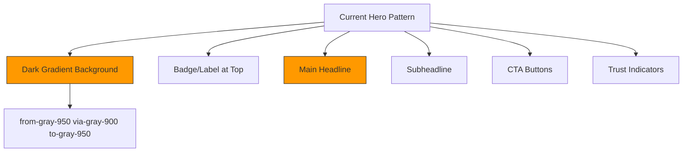
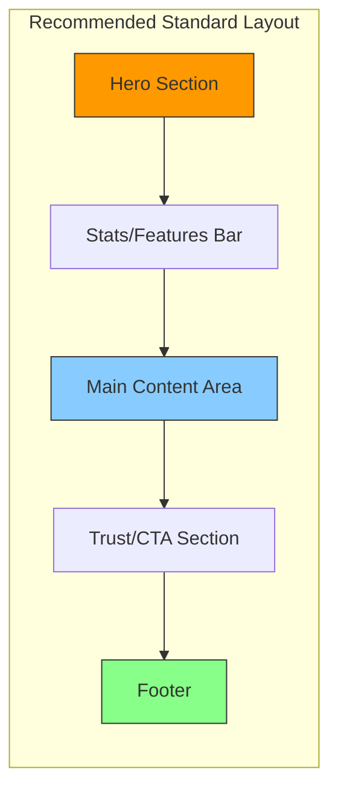

# Design Analysis: twcako.com Style Implementation

## Project Overview

This document analyzes the current ecommerce project structure and provides recommendations for implementing design patterns similar to twcako.com, focusing on layout and structure (hero sections, content flow, page organization).

---

## Current Project Analysis

### Pages Reviewed

| Page              | File Path                                    | Current Layout Approach                           |
| ----------------- | -------------------------------------------- | ------------------------------------------------- |
| Home              | `src/features/store/home/HomePage.tsx`       | Dark gradient hero → Stats bar → Content sections |
| Shop              | `src/features/store/shop/ShopPage.tsx`       | Dark header → White content area (rounded top)    |
| Product Detail    | `src/features/store/shop/ShopDetailPage.tsx` | Light gray background → White product card        |
| Affiliate Landing | `src/app/affiliate/landing/page.tsx`         | Similar to HomePage structure                     |

### Current Hero Section Patterns



### Current Content Flow

```
┌─────────────────────────────────────────┐
│         HERO SECTION (Dark)            │
│  - Badge pill                          │
│  - Headline                            │
│  - Description                          │
│  - Image (centered)                    │
│  - CTA buttons                         │
│  - Trust badges                        │
└─────────────────────────────────────────┘
                    ↓
┌─────────────────────────────────────────┐
│        STATS BAR (White)               │
│  - 3-column grid                       │
│  - Value + Label + Subtext             │
└─────────────────────────────────────────┘
                    ↓
┌─────────────────────────────────────────┐
│      CONTENT SECTIONS (Alternating)    │
│  - White background                   │
│  - Orange-50/40 background             │
│  - Grid layouts for cards             │
└─────────────────────────────────────────┘
```

---

## Recommended Design Improvements

### 1. Hero Section Uniformity

**Current Issue:** Inconsistent hero section approaches between pages

**Recommendations:**

- Maintain the dark gradient hero (well-received)
- Ensure consistent padding: `py-16 sm:py-24 lg:py-32`
- Standardize max-width container: `max-w-[1440px]`
- Use consistent CTA button styling across all pages

### 2. Content Transition Effects

**Current Approach (Shop Page):**

```tsx
// Dark header section
<section className="py-12 sm:py-16 bg-gradient-to-br from-gray-950 via-gray-900 to-gray-950">

// White content with negative margin for overlap
<div className="bg-white rounded-t-3xl -mt-8">
```

**Recommended Enhancement:**

- Add subtle shadow on the white content card
- Use smoother transition with `shadow-xl`
- Consider adding a subtle gradient at the transition point

### 3. Page Structure Standardization



### 4. Section Spacing Consistency

| Section Type     | Current Padding           | Recommended        |
| ---------------- | ------------------------- | ------------------ |
| Hero             | `py-16 sm:py-24 lg:py-32` | ✅ Keep consistent |
| Content          | `py-16 sm:py-20`          | ✅ Keep consistent |
| Inner containers | `px-6 sm:px-10 lg:px-16`  | ✅ Keep consistent |

### 5. Card Component Standardization

**Current Product Card Pattern:**

- Rounded corners: `rounded-2xl` to `rounded-3xl`
- Border: `border-gray-100` or `border-white`
- Hover effects: `hover:shadow-lg hover:-translate-y-0.5`

**Recommendation:** Maintain this pattern for consistency

### 6. Navigation/Header Considerations

**Current:** No explicit header component in store pages

**Consider for future:**

- Sticky header with blur effect: `backdrop-blur-md bg-white/80`
- Consistent logo placement
- Cart indicator always visible

---

## Specific Page Recommendations

### HomePage.tsx

- ✅ Hero section is well-structured
- ✅ Stats bar provides quick value proposition
- ✅ Consider adding more visual hierarchy with section labels

### ShopPage.tsx

- ✅ Good transition from dark header to white content
- ⚠️ Consider adding a "featured products" hero image instead of plain header

### ShopDetailPage.tsx

- ⚠️ Consider dark hero section like HomePage instead of light gray
- ✅ Product gallery layout is good
- ✅ Trust badges below product are well-placed

---

## Implementation Priority

1. **High Priority:**
   - Standardize hero section padding across all pages
   - Ensure consistent CTA button styling
   - Add proper section labels (badges)

2. **Medium Priority:**
   - Improve ShopPage hero (add visual content)
   - Add transition effects between sections
   - Standardize card hover effects

3. **Low Priority:**
   - Add sticky header component
   - Implement smooth scroll animations
   - Add micro-interactions on buttons

---

## Summary

The current project has a strong foundation with the dark gradient hero pattern. To align more closely with modern e-commerce designs (like twcako.com), focus on:

1. **Consistency** - Use the same hero pattern across all pages
2. **Visual hierarchy** - Clear section labels and spacing
3. **Transition effects** - Smooth content card transitions
4. **Trust signals** - Place trust badges prominently

The existing design is already well-structured; the main opportunity is to ensure uniformity across all store pages.
