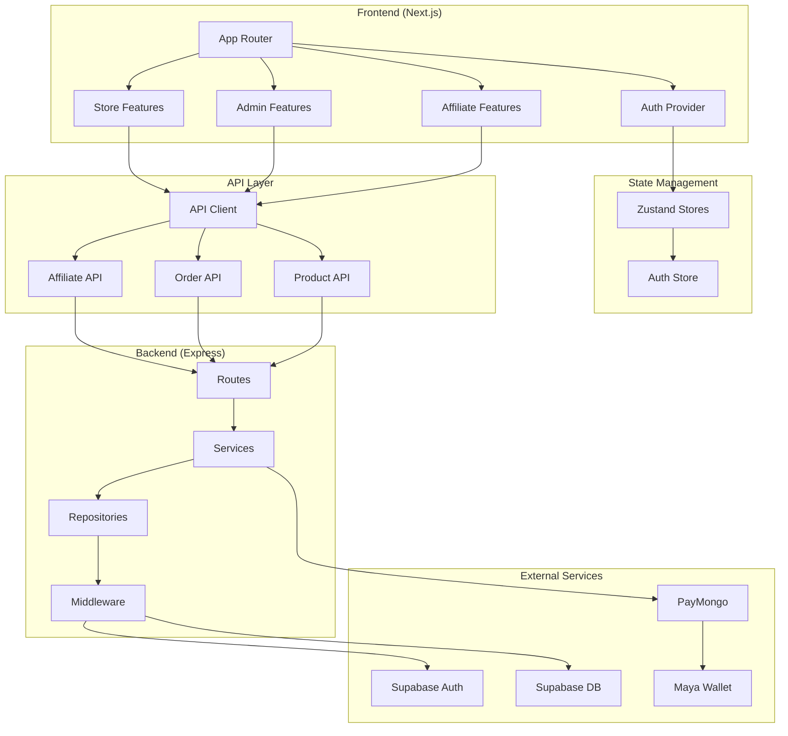
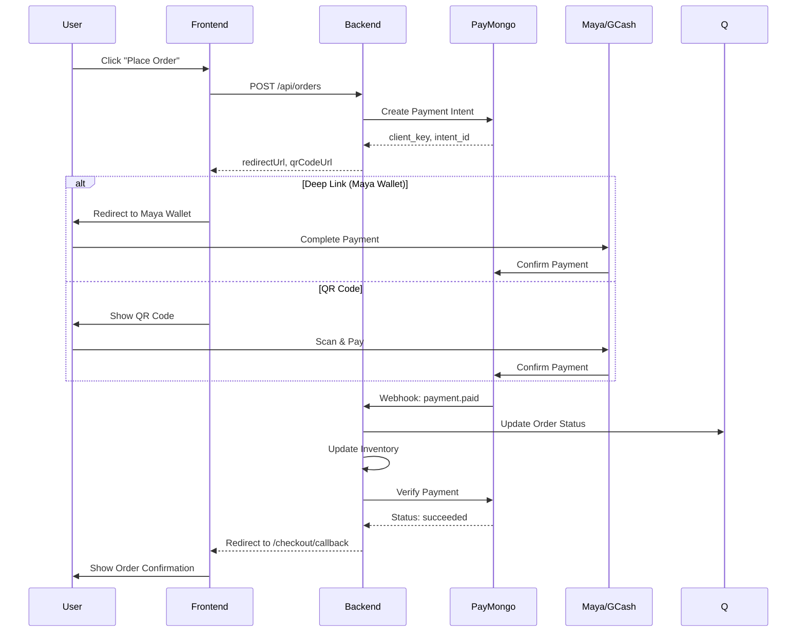
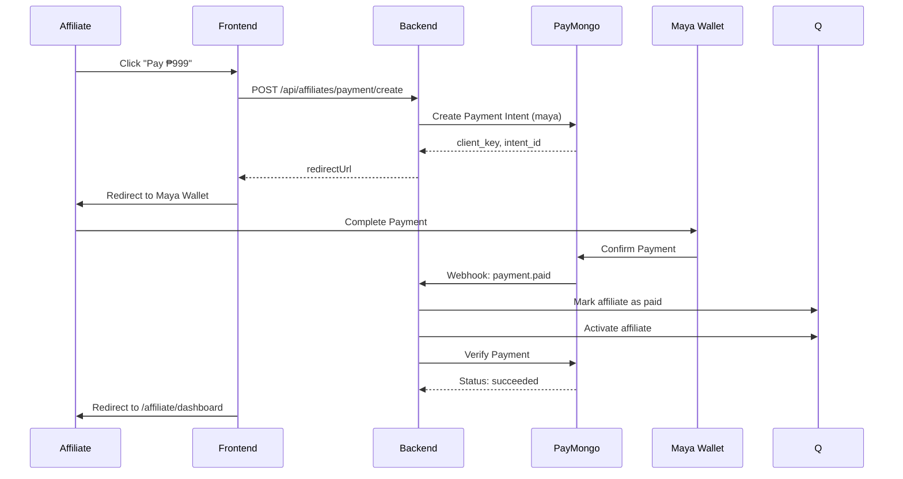

# Triad E-Commerce Platform - Architecture & Documentation

## Table of Contents

1. [Project Overview](#project-overview)
2. [Technology Stack](#technology-stack)
3. [Architecture Diagram](#architecture-diagram)
4. [Feature Modules](#feature-modules)
5. [Authentication & Authorization](#authentication--authorization)
6. [Payment Processing Flow](#payment-processing-flow)
7. [Affiliate System](#affiliate-system)
8. [Data Models](#data-models)
9. [API Structure](#api-structure)
10. [Frontend Structure](#frontend-structure)
11. [Key Patterns](#key-patterns)
12. [Environment Variables](#environment-variables)

---

## Project Overview

Triad E-Commerce is a full-stack Next.js e-commerce platform with:

- **Store Front**: Customer-facing shopping experience
- **Admin Panel**: Product, order, and affiliate management
- **Affiliate Portal**: Affiliate marketing dashboard with commission tracking
- **Payment Integration**: PayMongo with Maya Wallet support

---

## Technology Stack

### Frontend

- **Framework**: Next.js 14+ (App Router)
- **Language**: TypeScript
- **Styling**: Tailwind CSS
- **State Management**: Zustand
- **Forms**: React Hook Form + Zod
- **Icons**: Lucide React
- **HTTP Client**: Axios

### Backend

- **Runtime**: Node.js
- **Framework**: Express.js (separate server)
- **Database**: Supabase (PostgreSQL)
- **Authentication**: Supabase Auth
- **Payments**: PayMongo API

### Infrastructure

- **Hosting**: Vercel (frontend) + Render/Railway (backend)
- **Database**: Supabase
- **Storage**: Supabase Storage

---

## Architecture Diagram



---

## Feature Modules

### 1. Store Front (`app/(store)`)

- Homepage with hero, features, testimonials
- Product listing and detail pages
- Shopping cart
- Checkout flow with payment
- Testimonials

### 2. Admin Panel (`app/(admin)`)

- Dashboard with statistics
- Product management (CRUD)
- Order management
- Stock/POS tracking
- Affiliate management
- Affiliate sales tracking
- Testimonial moderation

### 3. Affiliate Portal (`app/(affiliate)`)

- Dashboard with stats and charts
- Profile management
- Referral link generation
- Commission sales history
- Commission balance tracking
- Cashout requests
- Training courses
- Community links

### 4. Authentication (`app/(auth)`)

- Login page
- Registration
- Password reset
- Google OAuth

---

## Authentication & Authorization

### Authentication Flow

```
User Login → Supabase Auth → JWT Token → Store in LocalStorage
                                    ↓
                            Auth Provider (Context)
                                    ↓
                    Auth Store (Zustand)
```

### Role-Based Access

| Role        | Access                         |
| ----------- | ------------------------------ |
| `user`      | Store front, make orders       |
| `affiliate` | Store front + Affiliate portal |
| `admin`     | Store front + Admin panel      |

### Auth Middleware

- `requireAuth` - Verify JWT token
- `requireAdmin` - Verify admin role
- `requireAffiliate` - Verify affiliate status

---

## Payment Processing Flow

### Store Checkout (PayMongo)



### Affiliate Registration Payment



---

## Affiliate System

### Affiliate Status Flow

```
Unregistered → Register → Pending Payment → Active
                              ↓
                        Payment Failed → Try Again
```

### Affiliate Dashboard Features

| Feature            | Description                                   |
| ------------------ | --------------------------------------------- |
| Dashboard          | Stats (sales, commissions, referrals) + Chart |
| Profile            | Name, email, status, Meta Pixel ID            |
| Referral Link      | Unique referral code and link                 |
| Commission Sales   | History of sales with commissions             |
| Commission Balance | Total, pending, available balance             |
| Cashout            | Request withdrawal to Maya Wallet             |
| Courses            | Training materials (placeholder)              |
| Community          | Facebook group, Telegram links                |

### Commission Structure

- Configurable per product (percentage or fixed)
- Sales go through: Pending → Approved → Paid
- Cashout via Maya Wallet

---

## Data Models

### Core Entities

#### User (Supabase Auth)

```typescript
{
  id: string;
  email: string;
  role: "user" | "admin";
  fullName: string;
  isAffiliate: boolean;
  affiliateStatus: "pending" | "active" | "suspended";
  affiliatePaymentStatus: "unpaid" | "paid";
}
```

#### Product

```typescript
{
  id: string;
  name: string;
  description: string;
  price: number;
  imageUrl: string;
  category: string;
  stock: number;
  isActive: boolean;
  createdAt: Date;
}
```

#### Order

```typescript
{
  id: string;
  userId: string;
  items: OrderItem[];
  total: number;
  status: 'pending' | 'paid' | 'shipped' | 'delivered' | 'cancelled';
  paymentMethod: 'gcash' | 'cod' | 'card';
  paymentStatus: 'pending' | 'paid' | 'failed';
  createdAt: Date;
}
```

#### Affiliate

```typescript
{
  id: string;
  userId: string;
  name: string;
  email: string;
  status: 'pending' | 'active' | 'suspended';
  paymentStatus: 'unpaid' | 'paid';
  pixelId?: string;
  storeId?: string;
  totalSales: number;
  totalCommissions: number;
  createdAt: Date;
}
```

#### Affiliate Sale

```typescript
{
  id: string;
  affiliateId: string;
  orderId: string;
  productId: string;
  productName: string;
  quantity: number;
  saleAmount: number;
  commissionEarned: number;
  status: "pending" | "approved" | "rejected";
  createdAt: Date;
}
```

#### Cashout Request

```typescript
{
  id: string;
  affiliateId: string;
  amount: number;
  mayaNumber: string;
  mayaName: string;
  status: "pending" | "approved" | "rejected";
  createdAt: Date;
}
```

---

## API Structure

### Base URL

```
Production: https://api.triecommerce.com
Development: http://localhost:4000
```

### API Endpoints

#### Authentication

| Method | Endpoint             | Description       |
| ------ | -------------------- | ----------------- |
| POST   | `/api/auth/register` | Register new user |
| POST   | `/api/auth/login`    | Login user        |
| POST   | `/api/auth/logout`   | Logout user       |
| GET    | `/api/auth/me`       | Get current user  |

#### Products

| Method | Endpoint            | Description            |
| ------ | ------------------- | ---------------------- |
| GET    | `/api/products`     | List products          |
| GET    | `/api/products/:id` | Get product            |
| POST   | `/api/products`     | Create product (admin) |
| PATCH  | `/api/products/:id` | Update product (admin) |
| DELETE | `/api/products/:id` | Delete product (admin) |

#### Orders

| Method | Endpoint          | Description          |
| ------ | ----------------- | -------------------- |
| GET    | `/api/orders`     | List orders (admin)  |
| GET    | `/api/orders/my`  | User's orders        |
| POST   | `/api/orders`     | Create order         |
| PATCH  | `/api/orders/:id` | Update order (admin) |

#### Affiliates

| Method | Endpoint                         | Description                     |
| ------ | -------------------------------- | ------------------------------- |
| GET    | `/api/affiliates`                | List affiliates (admin)         |
| GET    | `/api/affiliates/me`             | Current user's affiliate status |
| POST   | `/api/affiliates`                | Create affiliate (admin)        |
| POST   | `/api/affiliates/payment/create` | Create registration payment     |
| GET    | `/api/affiliates/payment/verify` | Verify payment                  |
| POST   | `/api/affiliates/cashouts`       | Request cashout                 |

#### Dashboard

| Method | Endpoint                   | Description          |
| ------ | -------------------------- | -------------------- |
| GET    | `/api/admin/dashboard`     | Admin statistics     |
| GET    | `/api/affiliate/dashboard` | Affiliate statistics |

---

## Frontend Structure

```
src/
├── app/                    # Next.js App Router
│   ├── (admin)/          # Admin route group
│   ├── (affiliate)/      # Affiliate route group
│   ├── (auth)/           # Auth route group
│   ├── (store)/          # Store route group
│   ├── affiliate/        # Public affiliate routes
│   ├── auth/             # Auth callbacks
│   ├── checkout/         # Checkout flow
│   └── s/[storeId]/     # Store referral links
│
├── features/              # Feature-based modules
│   ├── admin/           # Admin features
│   ├── affiliate/       # Affiliate features
│   ├── auth/            # Auth features
│   └── store/          # Store features
│
├── shared/              # Shared code
│   ├── components/
│   │   ├── layout/    # Layout components
│   │   └── ui/        # Reusable UI components
│   └── utils/          # Utilities
│
├── infrastructure/      # External integrations
│   ├── api/            # API clients
│   └── supabase/      # Supabase client
│
├── store/              # Zustand stores
├── types/              # TypeScript types
└── providers/          # React context providers
```

### Route Groups

| Group         | Layout                    | Description            |
| ------------- | ------------------------- | ---------------------- |
| `(admin)`     | AdminSidebar, AdminTopBar | Admin panel pages      |
| `(affiliate)` | AffiliateSidebar          | Affiliate portal pages |
| `(auth)`      | None (centered card)      | Login, register        |
| `(store)`     | Navbar, Footer            | Store front pages      |

---

## Key Patterns

### 1. Feature Module Pattern

Each feature follows:

```
feature-name/
├── index.ts           # Exports
├── PageName.tsx      # Main page
├── components/        # Feature components
├── hooks/            # Custom hooks
├── services/         # API services
├── types/            # Types
└── schemas/         # Zod schemas
```

### 2. Service Pattern

API calls encapsulated in services:

```typescript
// services/example.service.ts
export const exampleService = {
  async getAll(params) {
    return apiClient.get("/endpoint", { params });
  },
  async create(payload) {
    return apiClient.post("/endpoint", payload);
  },
};
```

### 3. Hook Pattern

Business logic in custom hooks:

```typescript
// hooks/useExample.ts
export function useExample() {
  const [data, setData] = useState(null);

  const fetchData = async () => {
    const result = await exampleService.getAll();
    setData(result);
  };

  return { data, fetchData };
}
```

### 4. Reusable UI Components

Located in `src/shared/components/ui/`:

- `Button` - Primary action buttons (variants: primary, secondary, ghost, danger, purple)
- `Input` - Form inputs with icons
- `Badge` - Status badges
- `Card` - Content containers
- `IconContainer` - Icon wrappers
- `Skeleton` - Loading placeholders
- `Spinner` - Loading indicators

### 5. Color Themes by Feature

| Feature   | Primary          | Secondary        |
| --------- | ---------------- | ---------------- |
| Auth      | Green (#22c55e)  | Gray (#111827)   |
| Admin     | Green (#22c55e)  | Gray (#111827)   |
| Affiliate | Purple (#9333ea) | Purple (#f3e8ff) |
| Store     | Purple (#9333ea) | Various          |

---

## Environment Variables

### Frontend (.env.local)

```env
NEXT_PUBLIC_SUPABASE_URL=your_supabase_url
NEXT_PUBLIC_SUPABASE_ANON_KEY=your_supabase_anon_key
NEXT_PUBLIC_API_URL=http://localhost:4000
```

### Backend (.env)

```env
PORT=4000
DATABASE_URL=your_supabase_connection_string
SUPABASE_SERVICE_KEY=your_service_role_key
PAYMONGO_SECRET_KEY=your_paymongo_secret
PAYMONGO_PUBLIC_KEY=your_paymongo_public
JWT_SECRET=your_jwt_secret
AFFILIATE_REGISTRATION_FEE=999
FRONTEND_URL=http://localhost:3000
APP_URL=http://localhost:3000
```

---

## Development Workflow

1. **Setup**: Clone repo, install dependencies
2. **Backend**: Start Express server on port 4000
3. **Frontend**: Run `npm run dev` on port 3000
4. **Database**: Use Supabase for data storage
5. **Testing**: Use PayMongo test keys for payments

---

## License

Proprietary - All rights reserved
